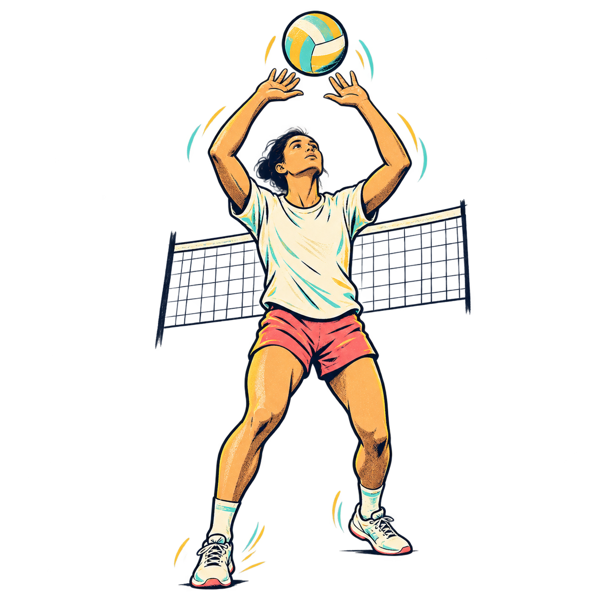
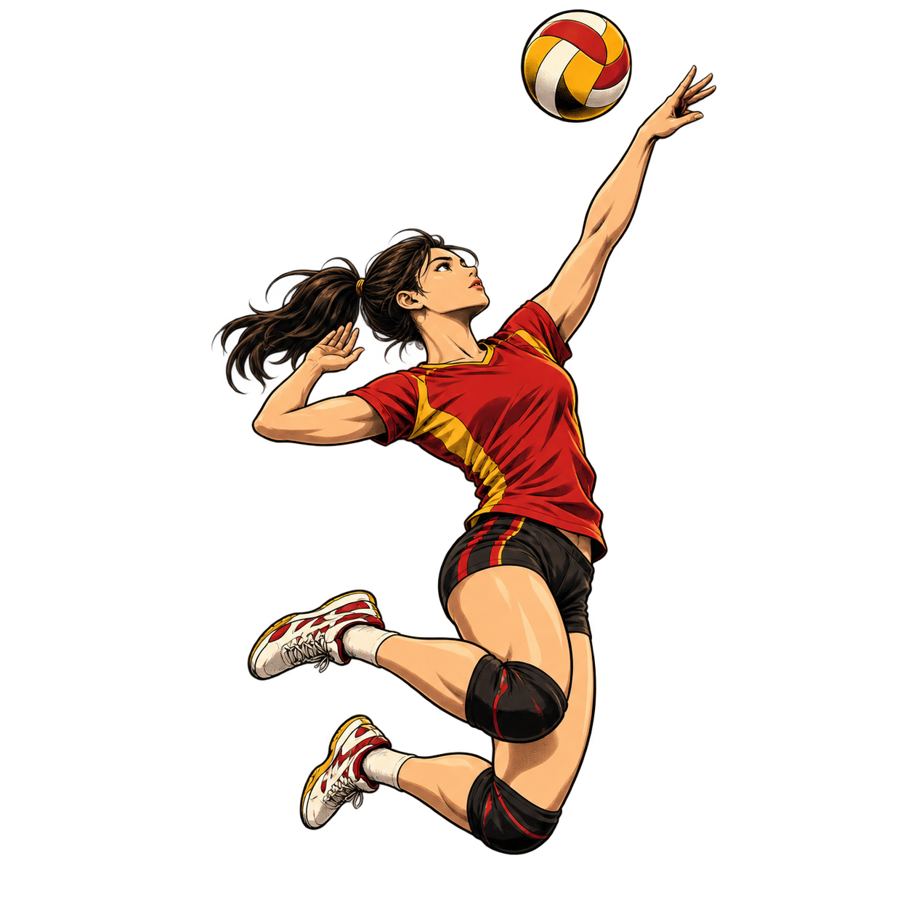
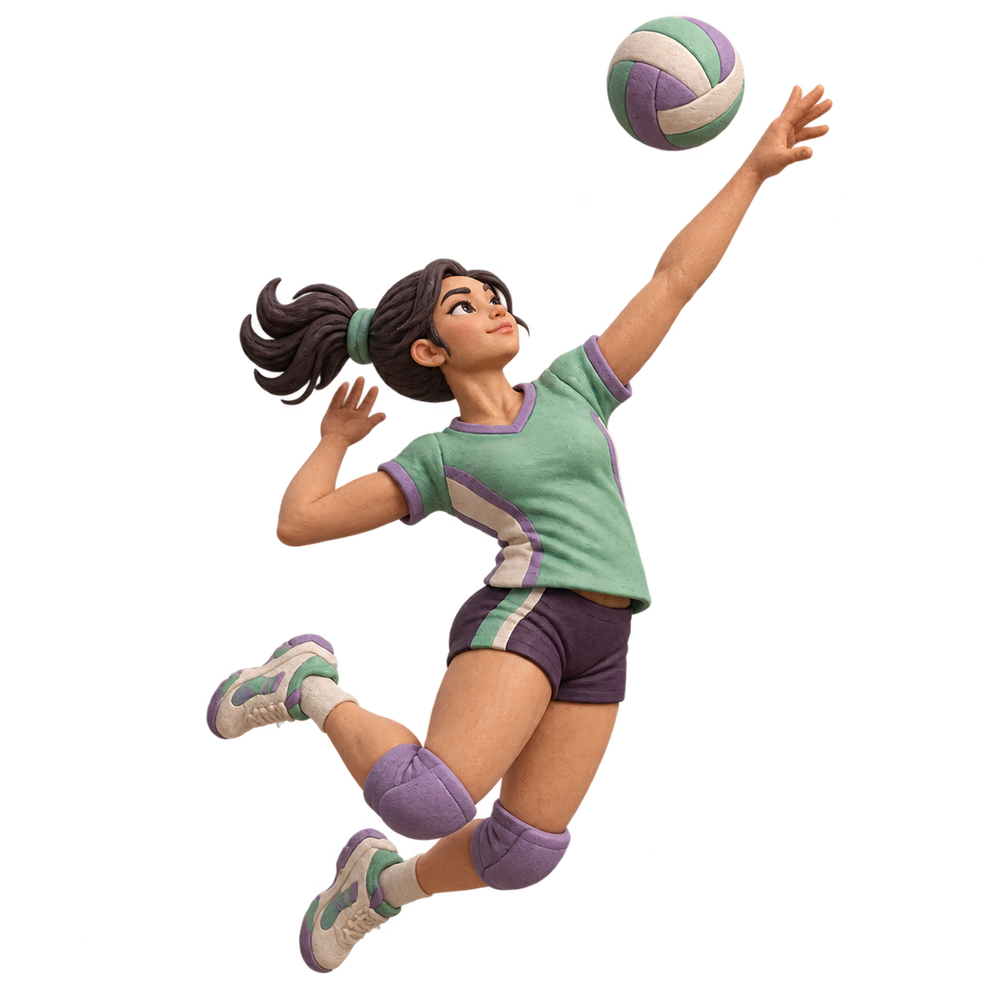
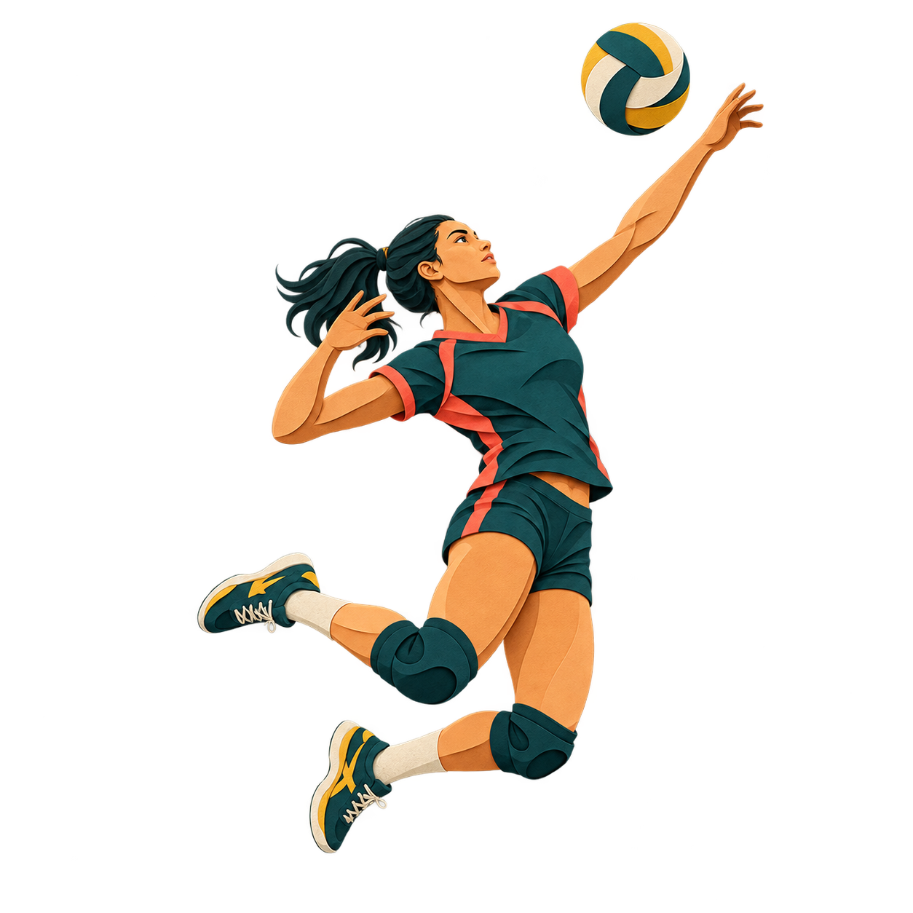
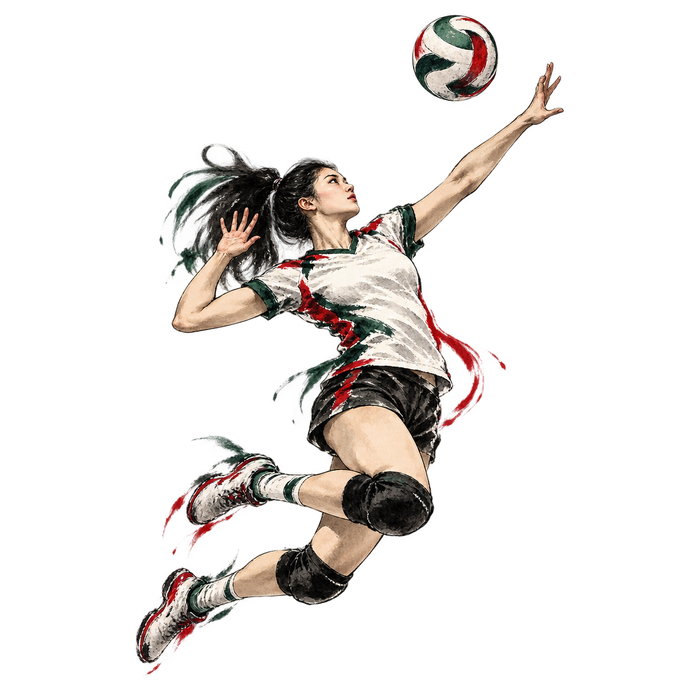
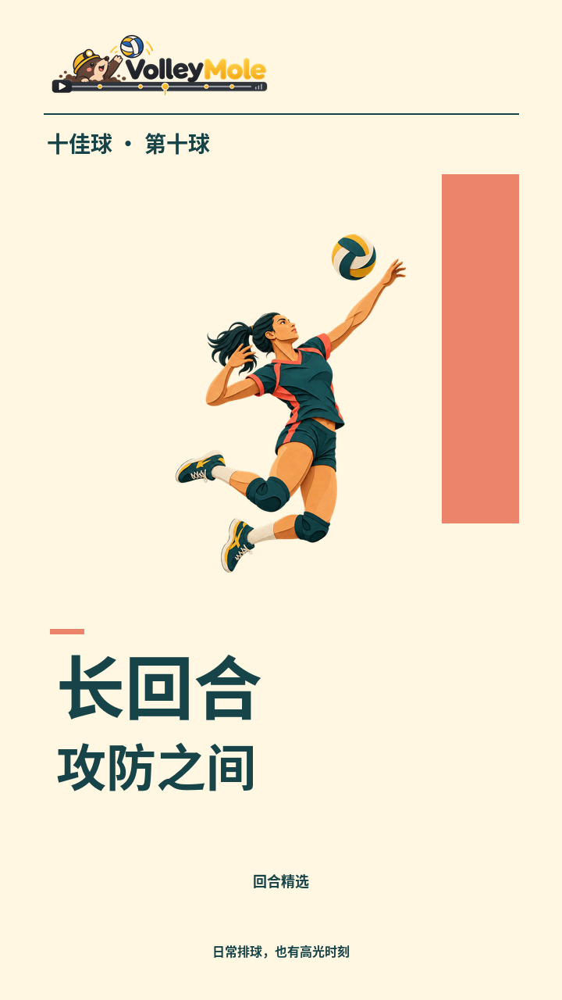
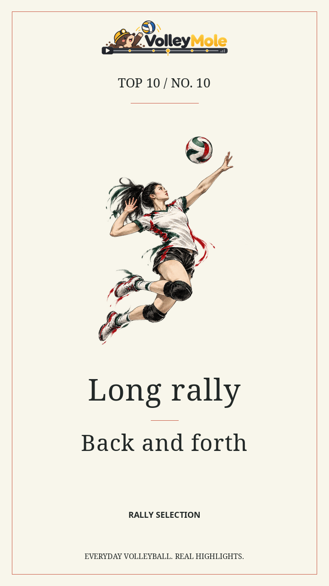

<div align="center">

  
  <h1>VolleyMole · 排球高光自动剪辑</h1>
  <p>把一整场日常排球比赛，剪成有回合、有排名、有原声的竖屏五佳球或十佳球。</p>
  <p>Python 3.12 · Linux x86-64 · 单卡 / 四卡 CUDA · H.264 + AAC</p>
  <p><a href="#快速开始">快速开始</a> · <a href="#五套插画风格">插画风格</a> · <a href="#四卡加速">四卡加速</a> · <a href="#文档与开发">文档</a> · <a href="#致谢与参考">致谢</a></p>
</div>

> 自动分析现已使用全场事件理解：`--collection highlights|bloopers|both`。双榜共享粗读、复核与缓存，支持不足数量输出。接口能力、本地声音模型协议和验收方式见 [事件理解与双榜](docs/事件理解与双榜.md)。

---

## 从比赛录像到高光成片

VolleyMole 面向单机位排球录像：在本地识别比赛状态、动作、人物和球轨迹，将本地多源测量与全场分块音视频理解合并为事件时间轴，再确定性生成竞技与趣味双榜，默认输出 **1080 × 1920、30 fps** 的竖屏视频，支持 720p、1440p 和 4K 画质选项。

```text
比赛录像 → 共享解码＋全场粗读 → 事件融合与一次复核 → 双榜评分 → 渲染与校验
                              ↓                  ↓
                        可追溯事实与证据       五佳球／十佳球＋五大囧
```

| 能力 | 说明 |
| --- | --- |
| 完整回合 | 保留检测到的回合及前后上下文，记录边界与遮挡的不确定性 |
| 跟球构图 | 球轨迹引导竖屏裁切，同时保留全场概览 |
| 活力版呈现 | 5 秒快切片头、中文倒计时排名、插画转场、短慢回放与现场原声 |
| 两种排名方式 | 自动模式使用事件理解和双榜评分；显式纯规则模式无需 API |
| 球员关注 | 可按球衣号码记录球员出现证据，OCR 按需启动 |
| 缓存与恢复 | 按素材、模型和配置校验分析缓存，支持从排名或渲染阶段重做 |
| 四卡流水线 | 支持跨批推理、辅助检测分卡及独立回合并行渲染 |

<p align="center">
  
  
  
  <br><sub>项目内置的装饰插画；不是比赛检测结果或成片截图。</sub>
</p>

## 快速开始

**环境要求**：Linux x86-64、Python 3.12、`uv`、系统可执行的 `ffmpeg` / `ffprobe`。GPU 推理还需要兼容 CUDA 12.8 的 NVIDIA 驱动；项目不会安装或修改驱动。当前依赖锁包含 GPU 库，CPU 运行也会安装这套依赖。

### 1. 安装

```bash
git clone https://github.com/rudykon/VolleyMole.git
cd VolleyMole
uv sync --locked
.venv/bin/volleymole --help
```

实现已统一到 `src/volleymole`，无需额外检出上游项目或准备 `tools/` 文件夹。

### 2. 获取模型

```bash
.venv/bin/volleymole models --directory models fetch
.venv/bin/volleymole models --directory models verify
```

模型下载后按固定大小与 SHA-256 校验，随后可在本地推理。下载地址可能受网络限制；也支持导入已取得的对应权重，见 [模型安装说明](docs/统一包安装与运行.md)。仓库不包含模型权重或比赛录像。

### 3. 放入录像并运行

将自己的比赛录像放在 `data/match.mp4`，运行无需大模型 API 的五佳球剪辑：

```bash
.venv/bin/volleymole run \
  --video data/match.mp4 --top-k 5 --ranker rules --device cuda:0
```

默认成片：`runs/match-top5/top5_lively.mp4`。没有可用 GPU 时可改用 `--device cpu`，推理会更慢。

## 整场十佳球：按日期合并多局（常规用法）

文件命名为 `年.月.日.局号`，例如 `2026.1.6.1.mp4`～`2026.1.6.4.mp4`，会识别为同一场比赛的四局。各局独立分析，再从**整场所有有效回合统一选出十佳球**，不是把各局集锦拼在一起。

```bash
# 先查看分组，不推理、不生成文件
.venv/bin/volleymole match --input-dir data/样例视频 --list

# 指定一场，默认十佳球、1080p、中文；自动模式需要配置音视频理解接口
.venv/bin/volleymole match --input-dir data/样例视频 --date 2026.1.6 \
  --devices cuda:0,cuda:1,cuda:2,cuda:3 \
  --pipeline-depth 2 --auxiliary-device cuda:0 --vball-engine ort-bound \
  --render-workers 2 --design-suite matchday

# 省略 --date：依次为目录内每个日期生成一条整场十佳球
.venv/bin/volleymole match --input-dir data/样例视频 --device cuda:0
```

自动模式输出至 `runs/matches/2026-01-06-top10/collections/highlights/`；趣味集锦位于同级 `bloopers/`，默认最多十段竞技素材。显式 `--ranker rules` 保留原输出目录。`--output` 指定所有场次的父目录；英文增加 `--design-language en`，画质和五套模板选项保持一致。原有 `run --video ...` 仍是单视频用法，默认五佳球。

当前样例目录分为 **2026-01-06（4 局）、2026-09-02（3 局）、2026-09-08（3 局）**。局号按数字排序；重复局号、无效日期或不符合命名格式的视频会报错，缺局会提示。更多规则与来源追溯见 [整场多局十佳球](docs/整场多局十佳球.md)。

## 四卡加速

以下配置已在四张 RTX 3090 上完成整场实测：

```bash
.venv/bin/volleymole run \
  --video data/match.mp4 --top-k 5 --ranker rules \
  --devices cuda:0,cuda:1,cuda:2,cuda:3 \
  --pipeline-depth 2 --auxiliary-device cuda:0 \
  --vball-engine ort-bound --render-workers 2
```

四张卡分别负责状态、动作、人物和球轨迹；此命令把辅助球检测分配到 GPU 0。`--devices` 不可与 `--device` 同时使用。渲染仍用 CPU/x264；`--render-workers 2` 并行制作独立回合。

**本机单次实测**：31 分 55 秒原片 → 2 分 50 秒成片，从新鲜四卡分析到验证共 **10 分 38 秒**。检测证据与基线一致；相同呈现代码下，并行渲染与串行渲染的成片逐字节一致。此结果为规则五佳、未开启号码 OCR，不代表其他硬件或 API 模式的耗时保证。分卡与后端收益随负载变化，详见 [性能优化与验证](docs/性能优化与验证.md)。

## 常用选项

成片画质通过 `--quality` 选择，适用于普通版和所有视觉套装：

| 参数 | 竖屏分辨率 | H.264 CRF | 用途 |
| --- | --- | --- | --- |
| `--quality 720p` | 720 × 1280 | 23 | 快速试剪、较小文件 |
| `--quality 1080p`（默认） | 1080 × 1920 | 20 | 日常发布 |
| `--quality 1440p` | 1440 × 2560 | 18 | 更高分辨率、更低压缩 |
| `--quality 2160p` | 2160 × 3840 | 17 | 4K 交付，耗时和内存需求最高 |

例如在原有运行命令后增加 `--quality 1440p`。切换画质会重新渲染和校验，已缓存的分析、追踪和排名可继续复用。帧率保持 30 fps，音频保持 AAC 192 kbps，剪辑时间线不变。

比赛画面直接从原片生成目标尺寸；更高档位无法补回原片缺失的细节。现有标题、插图和覆盖层仍按 720p 设计画布高质量缩放，并非原生 4K 字体/插画素材。历史预览样片仍为 720p，已有成片不会自动改写。

| 需求 | 参数 |
| --- | --- |
| 十佳球 | `--top-k 10` |
| 关注 12 号球员 | `--focus-player 12` |
| 经典呈现 | `--style classic`，默认 `lively` |
| 切换插画套装 | `--art-theme manga / clay / papercut / ink / retro`（任选其一） |
| 中文 / 英文标题 | `--title-template editorial-zh` / `editorial-en`；另有竞技、电影、贴纸、极简四组 |
| 五套动画转场 | `--transition-style velocity / paper / ink / prism / film`（任选其一） |
| 一键完整设计 | `--design-suite matchday / atelier / sumi / aurora / archive`；英文增加 `--design-language en` |
| 指定输出目录 | `--output runs/my-match` |
| 只分析到回合清单 | `--stop-after manifest` |
| 重做排名 / 渲染 | `--rerun-from rank` / `--rerun-from render` |
| 测量新鲜推理 | `--no-analysis-cache`，平时可复用缓存 |
| 查看全部参数 | `.venv/bin/volleymole run --help` |

## 五套完整视觉方案

推荐从完整套装开始：**赤线竞技、纸上球场、墨间回合、极光棱镜、胶片纪事**。标题、插图、配色、转场、比赛角标、回放提示和动画节奏统一设计；每套支持中文与英文。极光棱镜使用新生成的透明玻璃排球，其他套装保留原始插图并重新编排。

```bash
# 在原运行命令中增加一个选项，整套启用
--design-suite matchday

# 英文玻璃视觉
--design-suite aurora --design-language en

# 无需录像、GPU 或 API，生成五套双语动画预览
.venv/bin/python scripts/preview_design_suites.py --output outputs/my-design-suites

# 仅生成五套英文模板预览（1080p）
.venv/bin/python scripts/preview_design_suites.py --language en --output outputs/my-english-suites
```

<p>
  
  
  
</p>

套装统一控制下方三个单项；默认 `custom` 保留自由搭配。[查看五套设计、动画原则与使用指南](docs/完整视觉套装指南.md)。

## 五套插画风格

新增 **5 套 × 7 张 = 35 张** Codex 内置生图装饰素材，原版手绘仍保留为默认风格。每套都有排球、低姿救球、二传、飞扑、接球、扣球和空白排名横幅，均为透明 PNG，安装后可离线使用。

| 热血漫画 | 立体黏土 | 层叠剪纸 | 东方水墨 | 复古丝网 |
| :---: | :---: | :---: | :---: | :---: |
|  |  |  |  |  |
| `manga` | `clay` | `papercut` | `ink` | `retro` |

```bash
.venv/bin/volleymole run \
  --video data/match.mp4 --top-k 5 --ranker rules --device cuda:0 \
  --style lively --art-theme clay --output runs/match-clay
```

插画、排名横幅、标题卡配色、片头角标和回放强调色一起切换；比赛原片不做风格化重绘，检测、排名、分辨率、帧率和编码画质参数不因套装而改变。中文名次由程序排版，五佳与十佳共用素材。完整图集、只重做渲染和离线预览方法见 [插画风格指南](docs/插画风格指南.md)。

## 中英双语标题设计

新增 **五组设计 × 中英双语 = 十套标题模板**：刊物编辑 `editorial`、竞技速报 `arena`、电影片名 `cinema`、潮流贴纸 `pop`、极简栏目 `minimal`。通过 `-zh` / `-en` 选择语言，与插画套装独立组合。英文版使用独立英文字体和断行，并同步切换排名、片头、回放与页脚。

```bash
--art-theme papercut --title-template editorial-zh
--art-theme manga --title-template arena-en
```

默认 `legacy` 保留原版；新模板不重写比赛证据，也不改变视频编码画质。[查看十套模板与用法](docs/标题模板指南.md)。

<p align="center">
  
  
  
  <br><sub>实际标题卡版式；模板可与不同插画组合。</sub>
</p>

## 五套动画转场

竞技斜切 `velocity`、纸艺翻页 `paper`、水墨流动 `ink`、棱镜折光 `prism`、胶片光泄 `film`。由 Codex 内置生图创作原始材质，程序驱动入场与反向退场；与插画和中英标题独立组合，保留 2.2 秒完整标题阅读时间，不裁短完整回合。

```bash
# 在原运行命令上增加：
--art-theme manga --title-template arena-zh --transition-style velocity

# 离线生成五套动画预览和十段透明 ProRes 4444 MOV
.venv/bin/python scripts/preview_transitions.py \
  --output outputs/my-transitions --export-overlays
```

默认 `fade` 保留原版。[查看风格图集、时间线与剪辑软件用法](docs/动画转场指南.md)。

## 可选：大模型排名

将 [llm_api.example.json](llm_api.example.json) 复制为本地 `llm_api.json`，填写服务地址、模型名称和 API 密钥；该本地文件已被 Git 忽略。也可配置 `VOLLEYMOLE_API_KEY`、`VOLLEYMOLE_API_BASE`、`VOLLEYMOLE_MODEL` 环境变量。

配置后用 `--ranker auto`（或省略 `--ranker`）运行，可加 `--collection both`。新链路按块发送**覆盖全场的采样视频帧和同步音频**，并为候选提供一次更密集的上下文复核。失败、超时或证据不足时记录未完成项，使用已获得的有效事件；不伪造结果或凑数。`--ranker rules` 完全关闭 API 请求。接口协议、声音模型接入和缓存说明见 [事件理解与双榜](docs/事件理解与双榜.md)。

## 输出与可追溯性

自动模式的共用事件保存在 `event_timeline.json`，两类成片分别位于 `collections/highlights/`、`collections/bloopers/`，实际数量和不足原因见 `collections_report.json`。下面为显式规则模式的原有目录：

```text
runs/match-top5/
├── top5_lively.mp4           # 最终成片
├── match_manifest.json      # 回合、原片时间与检测证据
├── edit_decision.json       # 入选回合、排名及剪辑区间
├── timing_latest.json       # 本次命令分阶段耗时
├── render_report_lively.json
└── verification_lively.json # 成片解码与时间检查
```

比赛状态、回合边界和球衣号码均为模型推断，不等于人工标注真值。远景、遮挡、多球热身会影响识别，规则排名也可能选入非正式对抗。建议在发布成片前人工复核；音画验证通过不代表语义识别完全正确。

## 文档与开发

| 入口 | 内容 |
| --- | --- |
| [安装与运行](docs/统一包安装与运行.md) | 环境、模型导入、缓存、API 与运行限制 |
| [性能优化](docs/性能优化与验证.md) | 调度、后端、计时口径和复现实验 |
| [插画风格](docs/插画风格指南.md) | 五套素材、风格选择、离线预览和只重做渲染 |
| [标题模板](docs/标题模板指南.md) | 十套中英双语设计、英文字体、排版与离线预览 |
| [动画转场](docs/动画转场指南.md) | 五套生图材质、入退场动画、透明 MOV 导出与时间线 |
| [完整视觉套装](docs/完整视觉套装指南.md) | 五套统一美术指导、双语支持、一键应用与样片预览 |
| [文档目录](docs/README.md) | 当前使用文档与历史开发记录 |
| [贡献指南](CONTRIBUTING.md) | 项目结构、测试与提交约定 |
| [脚本目录](scripts/README.md) | 发布检查、性能对照与本地历史审计 |

```bash
# 不需要模型下载、GPU 或真实 API 的自动测试
.venv/bin/python -m unittest discover -s tests -p 'test_*.py'

# 上传前检查文件范围、较大文件与常见密钥格式
python3 scripts/check_release.py
```

## 致谢与参考

感谢以下项目的作者与维护者：

- [volleyball-ml-models](https://github.com/masouduut94/volleyball-ml-models) · Masoud Masoumi Moghadam：比赛状态分类、图像预处理与帧采样的实现来源。
- [fast-volleyball-tracking-inference](https://github.com/asigatchov/fast-volleyball-tracking-inference) · Alexander Sigatchov：VballNet 模型与推理参考，以及球定位、半径滤波和跟球裁切相关实现。
- [Ultralytics](https://github.com/ultralytics/ultralytics) 与 [EasyOCR](https://github.com/JaidedAI/EasyOCR)：检测与球衣号码识别基础能力。
- [PyTorch](https://pytorch.org/)、[Transformers](https://github.com/huggingface/transformers)、[ONNX Runtime](https://onnxruntime.ai/)：模型加载与推理。
- [OpenCV](https://opencv.org/)、[PyAV](https://pyav.org/)、[FFmpeg](https://ffmpeg.org/)、[NumPy](https://numpy.org/)、[SciPy](https://scipy.org/)、[Pillow](https://python-pillow.org/)：媒体处理与科学计算。
- [ZCOOL KuaiLe](https://github.com/google/fonts/tree/main/ofl/zcoolkuaile)：中文标题字体。

球衣号码功能也参考了 `volleyball-highlights` 的功能目标；当前 `jersey.py` 为独立实现，未复制该项目源码。

## 许可证与素材

第三方改编源码、依赖、字体和模型权重各自保留其许可边界，详见 [THIRD_PARTY.md](THIRD_PARTY.md) 与 [素材说明](src/volleymole/assets/README.md)。其中 Ultralytics 为 AGPL 依赖，不能把本项目整体视为 MIT 授权。

项目自有代码采用 [MIT License](LICENSE)。第三方代码、依赖和素材仍遵循各自的许可条款。模型权重、比赛录像和本地凭据不随仓库分发；MIT 许可不自动覆盖模型权重、品牌标志或其他单独授权的素材。
