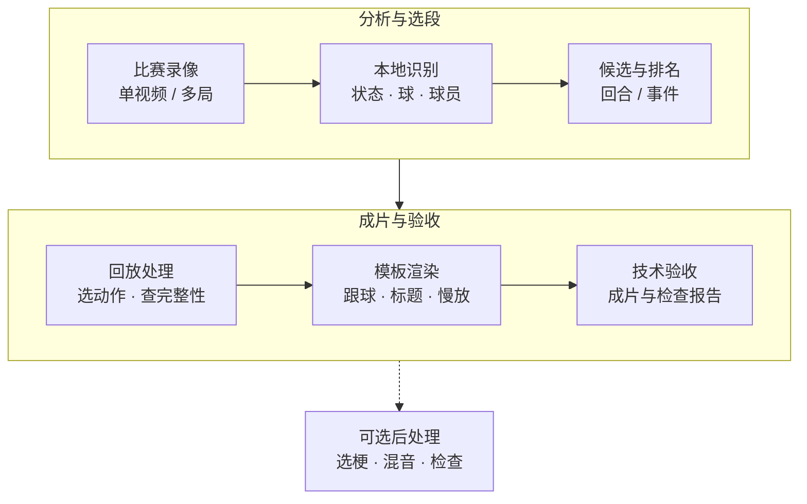
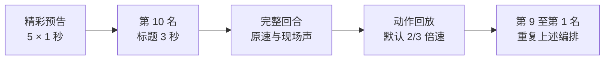

<div align="center">
  
  <h1>VolleyMole · 排球视频自动剪辑</h1>
  <p>从单机位比赛录像生成竖屏五佳球、十佳球，保留完整回合与现场原声。</p>
</div>

支持多局合并排名、跟球裁切、慢回放、中英标题和五套视觉设计。默认输出 **1080 × 1920 / 30 fps / H.264 + AAC**，可选 720p、1440p、2160p。分析结果支持缓存与断点恢复；事件双榜和梗配音可单独启用。

**本地模型提取比赛证据，规则或视觉大模型选择片段，程序按剪辑单生成成片。** 每个入选回合都能追溯到对应原片、源时间和分析记录，适合固定或轻微抖动的单机位比赛录像。

[主要功能](#主要功能) · [整体流程](#整体流程) · [模型与工具](#模型与工具) · [运行模式](#运行模式) · [快速开始](#快速开始) · [网页工作台](#网页工作台) · [成片模板](#自己的成片模板)

## 主要功能

| 功能 | 可以完成什么 |
| --- | --- |
| 单视频／整场多局 | 单段五佳、十佳；按日期归并多局，在全场候选中统一排名 |
| 完整回合与指定球员 | 结合状态、动作和球轨迹确定回合，可按球衣号码提供筛选依据 |
| 跟球竖屏构图 | 平滑移动裁切窗口，保留源画面高度；缺少可靠球轨迹时回到居中构图 |
| 精彩慢回放 | 选择值得重看的动作，检查准备、触球和后续；可要求全部入选球复核通过 |
| 五套视觉设计 | 中英标题、名次、预告、转场和透明角标；支持自定义 JSON 与版本封存 |
| 竞技／趣味双榜 | 可选全场事件理解，分别生成精彩榜和趣味榜，证据不足时允许少出片段 |
| 梗配音 | 成片后独立选择梗与时机，或按手工计划混入本地音频 |
| 网页与命令行 | 上传、任务队列、进度、预览下载、模板编辑、模型资源管理 |
| 缓存与验收 | 复用同源分析、更换模板重渲染；检查解码、音画对齐、时间线与字形 |

## 整体流程

网页和 CLI 使用同一套 Python 处理流程。模型产出带时间的证据和判断，FFmpeg 等工具负责执行实际剪辑；模板控制字体、颜色、构图和转场。


```mermaid
flowchart TB
    subgraph analysis["分析与选段"]
        direction LR
        A["比赛录像<br/>单视频 / 多局"] --> B["本地识别<br/>状态 · 球 · 球员"]
        B --> C["候选与排名<br/>回合 / 事件"]
    end
    subgraph production["成片与验收"]
        direction LR
        D["回放处理<br/>选动作 · 查完整性"] --> E["模板渲染<br/>跟球 · 标题 · 慢放"]
        E --> F["技术验收<br/>成片与检查报告"]
    end
    analysis --> production
    production -.-> G["可选后处理<br/>选梗 · 混音 · 检查"]
```

| 步骤 | 方法与职责 | 主要产物 |
| --- | --- | --- |
| **1. 读取录像** | FFprobe 获取属性，PyAV 解码并保留原始时间戳；多局分别记录来源 | 原片身份、帧时间与音轨信息 |
| **2. 本地识别** | 识别比赛状态、球员、动作候选和球轨迹；需要号码时才启用 OCR | 检测记录、轨迹、可选号码观察 |
| **3. 提取候选** | 默认用 `fused_v2` 融合运动与状态，定位完整回合；事件路线另做全场分块粗读 | 回合清单／事件候选 |
| **4. 选球排名** | 回合路线规则预筛后可做三帧语义排序；事件路线密集复核后由程序组合评分 | `edit_decision.json` 剪辑单 |
| **5. 确定回放** | 自动视觉复核使用连续画面、独立核验与边界检查；也支持匹配的已有复核记录或本地候选 | 逐球回放状态与起止时间 |
| **6. 渲染成片** | 按轨迹平滑裁切，绘制标题和名次，拼接原速回合、慢放及转场 | 竖屏 MP4、渲染时间线 |
| **7. 可选配音** | 主片完成后独立选梗、映射慢放时间、混入本地素材并短时压低原声 | 配音计划、独立混音版 |
| **8. 校验与收录** | 主片在配音前完成技术验收；混音版另查音频和画面码流，网页按实际状态收录 | 验证报告、视频、封面与描述文件 |

默认十佳球沿“完整回合”路线运行。事件理解不受规则前 25 名候选限制，两条路线的区别见[运行模式](#运行模式)。自动回放 API 是否运行取决于排名方式、配置及 `replay-review`，打开回放开关不等于所有回放已完成视觉复核。

在 `lively` 风格的精彩榜中，十个回放均可用时，成片时间线如下：


```mermaid
flowchart LR
    P["精彩预告<br/>5 × 1 秒"] --> T["第 10 名<br/>标题 3 秒"]
    T --> R["完整回合<br/>原速与现场声"]
    R --> S["动作回放<br/>默认 2/3 倍速"]
    S --> N["第 9 至第 1 名<br/>重复上述编排"]
```

所有片段从对应原视频截取，不重新生成比赛画面。`auto` 可能省略无法确认的回放；`lively` 精彩榜可用 `--replay-review required` 要求每球都有合格复核记录。完整解释见[自动化剪辑原理与流程](docs/自动化剪辑原理与流程.md)。

## 模型与工具

### 本地识别

模型权重先下载并校验，推理阶段读取本地文件。不同模型分担具体任务，不把单次检测直接当成“得分”或“精彩”的结论。

| 模型／框架 | 输入与输出 | 运行条件 |
| --- | --- | --- |
| **VideoMAE · PyTorch / Transformers** | 连续画面 → 比赛中、非比赛、发球状态 | 标准本地分析 |
| **YOLO · Ultralytics** | 画面 → 接球、二传、扣球、拦网候选，以及人物位置与可用姿态关键点 | 标准本地分析；辅助球检测按证据缺失触发 |
| **VballNet seq9 · ONNX Runtime** | 连续 9 帧灰度图 → 球的位置、可见性和运动轨迹 | 标准球追踪，可选 CUDA 后端 |
| **EasyOCR** | 球员躯干裁图 → 球衣数字观察 | 指定 `--focus-player` 时启用 |
| **PANNs Cnn14_DecisionLevelMax** | 声音 → 笑声、掌声等带时间的类别概率 | 可选事件路线，已安装声音模型时自动启用，可关闭 |
| **ResNet18＋双向 GRU** | 连续画面 → 更细的动作时间候选 | 实验性可选模块，显式导入证据，未作为默认生产模型 |

共享推理复用同一次解码。单卡可运行整套分析；四卡模式按状态、动作、人物、球轨迹分工，并保留连续时序，不把录像分成互不相连的四段。

### 视觉大模型与 API

主流程读取本地 `llm_api.json` 的 `llm` 节点，使用 **OpenAI 兼容 Chat 接口**；服务商和模型可配置。兼容接口格式不代表使用 OpenAI 的模型，也不代表服务自动具备图片、音频和结构化输出能力。

| 用途 | 发给模型的内容 | 模型负责什么 |
| --- | --- | --- |
| 回合语义排序 | 每候选最多 3 张关键帧与结构化证据；或独立视觉模型先生成评审 | 在候选内选择、排序、生成简短标题和理由 |
| 事件理解 | 默认 24 秒分块、4 秒重叠，粗读 2 FPS、复核 8 FPS；按配置附同步音频 | 引用真实帧描述事实与九维评分，程序据此生成两榜 |
| 慢回放复核 | 连续全景和同一时刻局部图，独立一轮不接收首轮答案 | 判断动作与必要后续，给出准备、触球和结束的帧锚 |
| 梗配音导演 | 动作附近截图、可用素材与规则，默认 12 FPS 抽样 | 返回使用／跳过、合适的梗和时机；实际混音由本地完成 |

主流程没有固定的大模型型号，可用 `--model`、`--vision-model` 明确指定；项目已有 `glm-5.3-flash` 的配置与接入记录。独立配音导演默认使用 AiHubMix 的 `qwen3.5-35b-a3b`，可以覆盖。模型名称和接口接通不构成动作准确率保证，实际使用情况以运行报告为准。

API 只提供结构化判断，程序检查候选 ID、帧引用、时间边界和完整性后执行。回合排序失败可以记录规则兜底；事件路线和必需回放各自保留失败／未完成状态，不能把无效响应当成有效判断。

### 剪辑、渲染与校验

| 工具 | 职责 |
| --- | --- |
| **FFprobe / PyAV** | 读取视频属性、解码与原始时间戳对齐 |
| **NumPy / OpenCV** | 轨迹处理、平滑跟球构图、裁切与缩放 |
| **Pillow / FontTools** | 字体覆盖检查、标题与透明图层绘制 |
| **FFmpeg** | 截取、变速、原声处理、混音、拼接与 H.264 / AAC 编码 |
| **Python 编排与校验** | 缓存指纹、断点恢复、JSON 约束、来源追溯及音画检查 |

当前编码使用 CPU `libx264`，GPU 参数主要控制模型推理。分析、排名和呈现分开缓存：只更换字体或视觉模板时，通常可复用已有识别与选球结果。

## 运行模式

| 模式 | 选球方式 | API 与适用场景 |
| --- | --- | --- |
| **本地规则** | 回合检测、规则分数、去重与轻度多样性选择 | `--ranker rules`；资源安装后可离线运行，适合先出初版 |
| **回合语义排序** | 规则候选池＋三帧视觉评审，失败可规则兜底 | `--ranker auto --analysis-mode rallies`；在完整回合间辅助挑选 |
| **全场事件理解** | 全场粗读、候选密集复核、程序组合评分 | `--ranker auto --analysis-mode events`；适合具体动作、趣味榜和双榜 |

**CLI 默认 `ranker=auto`，网页创建页默认本地规则。** 默认精彩榜使用回合路线；`--collection bloopers` 或 `both` 在 `analysis-mode=auto` 下启用事件路线。没有配置 API 时，默认回合排序可以规则兜底；完整回合不足目标数量时报错，事件路线允许不足数量输出。

回放与选球模式分别控制：规则排名＋默认 `replay-review=auto` 不调用复核 API。**`required` 的逐球复核要求适用于 `lively` 风格的精彩榜；双榜中只约束精彩榜，趣味榜和 `classic` 不适用。** 必要时会调用配置的视觉模型。梗配音是独立后处理，不会因选择水墨模板就自动添加。

当前验证覆盖文件、时间线、音画和字形等技术正确性。精彩程度、真实触球、动作力度、号码识别与幽默时机仍可能误判；已有动作小样本或声音评测不能代表整套集锦质量。评测范围与复现入口见[开发与验证](docs/开发与验证.md)。

## 快速开始

环境：Linux x86-64、Python 3.12、[uv](https://docs.astral.sh/uv/)、FFmpeg / FFprobe。GPU 运行需要兼容 CUDA 12.8 的驱动；当前依赖锁包含 GPU 库。

```bash
git clone https://github.com/rudykon/VolleyMole.git
cd VolleyMole
uv sync --locked
source .venv/bin/activate

# 下载并校验模型与视觉素材，之后可离线使用
volleymole models --directory models fetch
volleymole assets fetch

# 单视频五佳球；规则排名无需 API
volleymole run --video data/match.mp4 --ranker rules \
  --template matchday --output runs/my-match
```

整场多局录像按 `年.月.日.局号.mp4` 命名，例如 `2026.9.15.1.mp4`：

```bash
volleymole match --input-dir data/matches --list
volleymole match --input-dir data/matches --date 2026-09-15 \
  --ranker rules --template atelier --output runs/matches
```

`run` 默认五佳，`match` 默认十佳；使用 `--top-k 5` 或 `--top-k 10` 调整。输出目录保存成片、剪辑单和验证报告。更多安装说明见[安装与运行](docs/README.md#install)。

## 网页工作台

安装依赖后启动中文网页界面：

```bash
volleymole web --open
# 默认 http://127.0.0.1:8765；可用 --port 更换端口
# 同时允许局域网访问：将下方 IP 替换为本机局域网 IPv4 地址
volleymole web --host 127.0.0.1 --host 172.22.13.156 --port 8787
```

网页支持录像上传、单视频与多局剪辑、全部公开参数、模板编辑、任务队列与取消、真实视频封面与预览下载、慢回放复核、配音时间点编辑、模型与素材安装，以及 API 与算法配置。创建页按录像、目标、风格排列并提供可读摘要；首页优先展示任务与最近成片，媒体库分别管理比赛源片、剪辑素材与正式成片。`runs/` 仅供后台处理；网页成片统一保存在 `outputs/published/`，每份包含 `video.mp4`、`poster.jpg`、`manifest.json`，清理后台不影响已收录成片。任务详情显示真实阶段记录，生成后可直接播放，并将执行完成与成片检查分开展示。无需 Node.js 或前端构建，详见[网页工作台](docs/README.md#web)与[成片目录及格式](docs/README.md#outputs)。

## 自己的成片模板

模板使用 JSON 保存风格、语言、转场、画质、慢回放及配音设置，可以直接读取文件，也可以导入后按名称切换。

```bash
# 查看五套内置模板
volleymole templates list

# 导出后按自己的习惯编辑
volleymole templates export matchday --name my-team --output my-team.json

# 导入统一模板库的 templates/custom/，随后按名称使用
volleymole templates import my-team.json
volleymole run --video data/match.mp4 --ranker rules --template my-team

# 也可直接使用 JSON，临时覆盖语言或画质
volleymole run --video data/match.mp4 --ranker rules \
  --template ./my-team.json --design-language en --quality 1440p
```

| 模板 | 视觉设计 |
| --- | --- |
| `matchday` | 赤线竞技 |
| `atelier` | 纸上球场 |
| `sumi` | 墨间回合 |
| `aurora` | 极光棱镜 |
| `archive` | 胶片纪事 |

<p>
  
  
  
  
  
</p>

使用 `design_suite: "custom"` 可自由组合插画、标题和转场。配音仍是成片后的独立步骤，同一份模板通过 `meme-audio --template my-team` 生效。完整格式、优先级和命令见[自定义成片模板](docs/模板与配音.md#custom-template)。

全部模板统一保存在 [templates/](templates/README.md)：`builtin/` 存放五套内置配置，`custom/` 存放个人配置，`bundles/` 存放带字体、素材和代码快照的定稿包。命令行和网页使用相同目录规则，项目默认位置不随启动目录改变。详见[模板目录](docs/模板与配音.md#template-library)和[水墨 v2.0.0 定稿版](docs/模板与配音.md#sumi)。

## 常用选项

| 需求 | 参数 / 入口 |
| --- | --- |
| 纯本地规则排名 | `--ranker rules` |
| 语义排名 | 复制 `llm_api.example.json` 为 `llm_api.json`，配置 API 后使用 `--ranker auto` |
| 竞技与趣味双榜 | `--collection both --analysis-mode events --ranker auto` |
| 指定单卡 | `--device cuda:0` |
| 四卡并行 | `--devices cuda:0,cuda:1,cuda:2,cuda:3 --pipeline-depth 2` |
| 只重做呈现 | 原命令保留输出目录，加 `--rerun-from render` |
| lively 精彩榜每球回放复核通过 | `--replay-review required`，需要视觉 API 或匹配的有效逐球复核记录 |
| 添加本地配音 | `volleymole meme-audio --help` |
| 查看全部参数 | `volleymole run --help` / `volleymole match --help` |

语义模式会向配置的服务发送抽样画面，部分事件模式还使用音频。回合语义排序失败会记录规则兜底；事件分析和必需回放不静默跳过失败。详见[事件双榜](docs/自动化剪辑原理与流程.md#events)、[慢回放](docs/自动化剪辑原理与流程.md#replay)与[配音](docs/模板与配音.md#meme-local)。

## 仓库内容

```text
src/volleymole/     运行代码、提示词与素材来源
scripts/           素材准备、评测、预览与发布检查
tests/            回归测试
docs/             使用、原理、模板与开发四份文档
templates/        统一模板库：builtin/、custom/、bundles/
```

视频、模型、密钥、个人模板、运行缓存、实验报告和本地归档均不提交。完整插画和字体由独立素材包分发；GitHub 保留少量预览图。

```bash
python scripts/check_release.py --history  # 文件、历史凭据及大文件检查
python scripts/check_release.py --archive dist/VolleyMole-github.zip  # 导出干净源码
python -m unittest discover -s tests       # 完整测试需先安装视觉素材
```

开发说明见[CONTRIBUTING](CONTRIBUTING.md)，更多指南见[文档目录](docs/README.md)。项目代码采用 [MIT](LICENSE)；依赖、改编代码和模型的许可分别见[第三方来源](THIRD_PARTY.md)。
