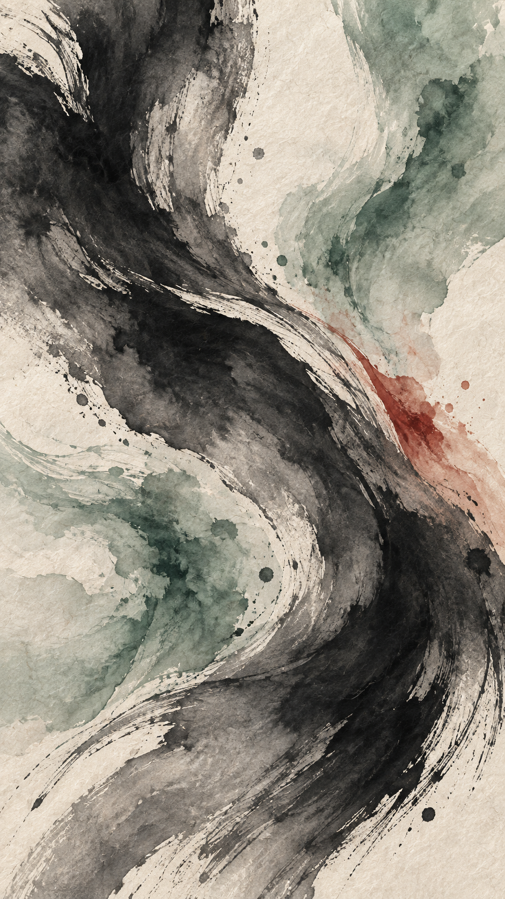
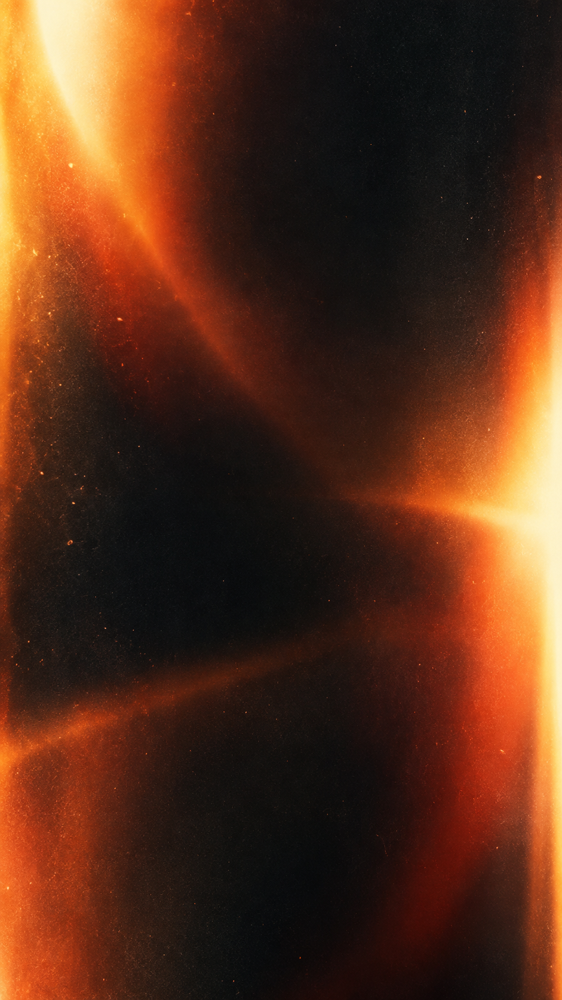

# 五套动画转场

五张独立材质通过 Codex 内置 `image_gen` 生成，原始 PNG 原样放入项目；运行时用程序驱动遮罩、缓动和合成，不再调用生图工具。每套包含入场和反向退场，可与插画、中文／英文标题独立组合。

## 风格与搭配

| 风格 | 参数 | 视觉与运动 | 示例搭配 |
| --- | --- | --- | --- |
| 竞技斜切 | `velocity` | 石墨、朱红、织物颗粒；硬朗斜向扫屏 | `manga` + `arena-zh` / `arena-en` |
| 纸艺翻页 | `paper` | 奶油纸、鼠尾草绿、陶土色；弧形纸边揭幕 | `papercut` + `editorial-zh` / `editorial-en` |
| 水墨流动 | `ink` | 宣纸、墨色、淡玉色；带纹理的柔边铺展 | `ink` + `cinema-zh` / `cinema-en` |
| 棱镜折光 | `prism` | 深蓝、银色、冷紫玻璃；分层错位扫屏 | `clay` + `minimal-zh` / `minimal-en` |
| 胶片光泄 | `film` | 炭黑、琥珀、暖橙光晕；径向柔边扩散 | `retro` + `cinema-zh` / `cinema-en` |

<p>
  
  
  
  
  
</p>

以上是材质原图，不是动画帧序列。纸艺、折光是视觉风格名称；动画采用二维合成，不是三维物理翻页或实时光线追踪。

## 项目内使用

在原运行命令中增加 `--transition-style` 即可：

```bash
.venv/bin/volleymole run \
  --video data/match.mp4 --top-k 5 --ranker rules --device cuda:0 \
  --style lively --art-theme manga --title-template arena-zh \
  --transition-style velocity --output runs/match-velocity
```

已有运行只换呈现，可在原命令上保留其他配置，增加 `--transition-style ink --rerun-from render`。这会替换该目录的成片；保留多个版本时请先备份或使用独立运行目录。也可以直接渲染并校验：

```bash
.venv/bin/python -m volleymole.media_worker render \
  --run runs/match-top5 --style lively --workers 2 \
  --art-theme retro --title-template cinema-en --transition-style film
.venv/bin/volleymole verify --run runs/match-top5 --style lively
```

主流程默认 `fade`，保留原版淡入淡出。直接渲染省略参数时读取 `run_config.json`，旧配置回退为 `fade`；显式参数优先。新转场仅适用于 `lively`。所选转场和素材哈希进入渲染缓存签名，报告及每段时间线记录 `transition_style`。

## 时间线与画质

| 转场内时间 | 帧范围（从 0 开始） | 内容 |
| --- | --- | --- |
| 0.0–0.4 秒 | 0–11 | 前段末帧 → 材质遮盖 → 完整标题 |
| 0.4–2.6 秒 | 12–77 | 2.2 秒完整静止标题，排名与文字不被遮挡 |
| 2.6–3.0 秒 | 78–89 | 完整标题 → 反向材质遮盖 → 后段首帧 |

保持原有 90 帧／3 秒结构，第一帧与前段末帧一致，最后一帧与后段首帧一致。动画只发生在独立标题转场中，不覆盖完整回合；边界使用冻结帧，比赛本身不会被风格化重绘或额外裁短。分辨率 720×1280、30 fps、现有 H.264 编码参数不变，不增加模型推理。素材每段加载一次，不逐帧读盘。转场沿用项目低音量合成风声，未使用生图模型生成音频。

## 离线预览与透明素材导出

无需模型、GPU、API 或比赛录像，只需项目环境和 FFmpeg：

```bash
.venv/bin/python scripts/preview_transitions.py \
  --output outputs/my-transitions --export-overlays
```

打开输出目录的 `index.html`，观看五套搭配预览、检查动画帧时间线、下载透明 MOV。输出目录必须是新目录，避免覆盖已有预览。默认预览使用装饰性标题卡，不是比赛证据。

每套导出两段独立文件：`<style>-in-alpha.mov` 和 `<style>-out-alpha.mov`。规格为 **ProRes 4444、720×1280、30 fps、24 帧／0.8 秒、straight alpha、无音轨**。这两段是剪辑软件专用的可复用转场，不是三秒标题转场本身；每段均包含透明、完全遮盖、透明的完整过程，二者运动方向相反。

把 MOV 放在两段素材上方的视频轨道，底层切点对齐 MOV 第 12 帧（从 0 开始，即 0.4 秒）。不要使用绿幕抠像，也不要先转成普通 H.264 MP4——它会丢失透明通道。先确认所用剪辑软件支持 ProRes 4444 Alpha；浏览器通常不能直接预览此编码，网页上的 MP4 用于观看效果。MOV 较大，仅导出在被 Git 忽略的 `outputs/`，仓库和 wheel 只分发约 13 MiB 原始 PNG 及程序。

也支持两段已有 720×1280、30 fps、含音轨、各不超过十秒的短样片：

```bash
.venv/bin/python scripts/preview_transitions.py \
  --output outputs/my-match-transitions \
  --before path/to/before.mp4 --after path/to/after.mp4 \
  --title 多拍攻防
```

真实样片请填写其剪辑单原始标题；未填则用“球场时刻”类通用文案。样片示例名次固定第一球，不能作为完整比赛排名验收。正式五佳／十佳请走项目渲染流程。

## 来源与验证

完整提示词、生成文件名和逐图 SHA-256 见 [素材生成记录](../src/volleymole/assets/transitions/prompts.json)。使用内置生图模式，没有调用 CLI/API 回退；原图保持不透明，透明动画通道来自程序的转场遮罩，不是对原图做抠图。

验证覆盖原版逐帧兼容、五套首尾帧、完整标题停留区间、透明 MOV 首尾和切点、独立风格配置与时间线不变。预览脚本实际编码后全量解码，检查 90 帧及 0.5／1.5／2.5 秒标题误差；拼接后再次检查标题。结果写入输出目录的 `validation.json`。这些是呈现层验证，不代表重新执行全场检测、排名或源声音对齐验收。
