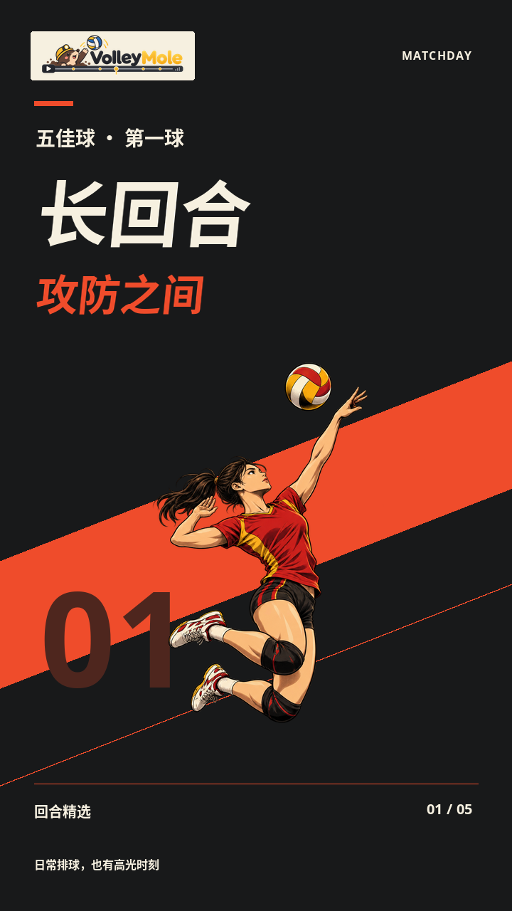
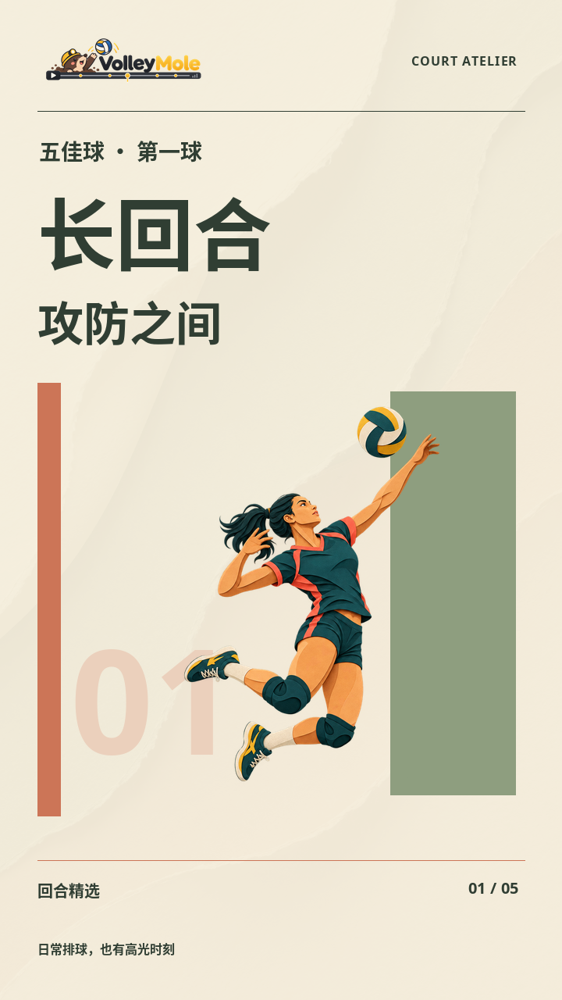
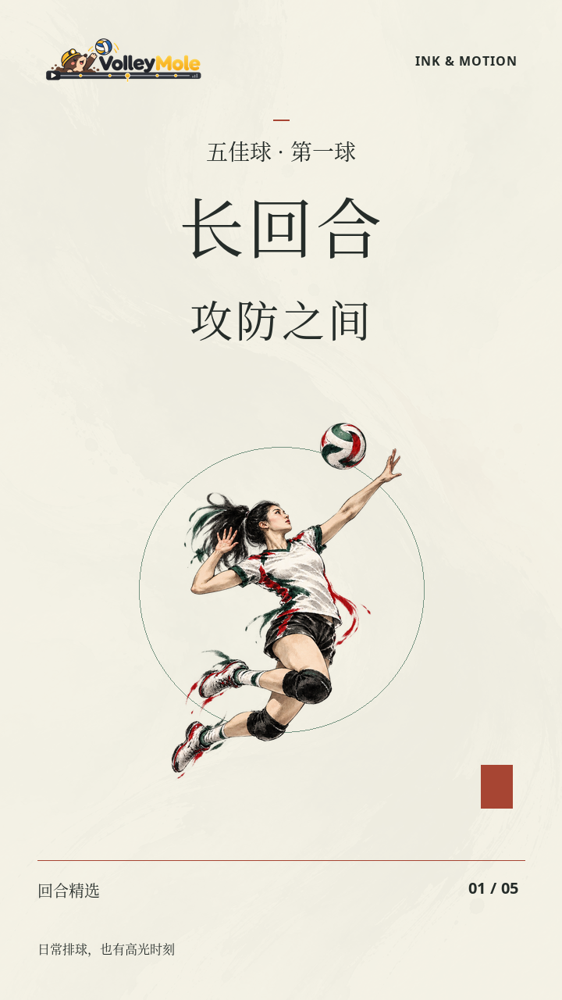
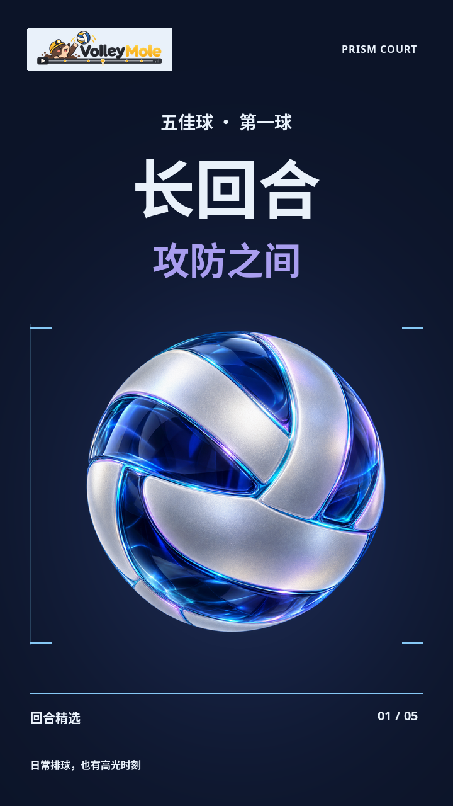
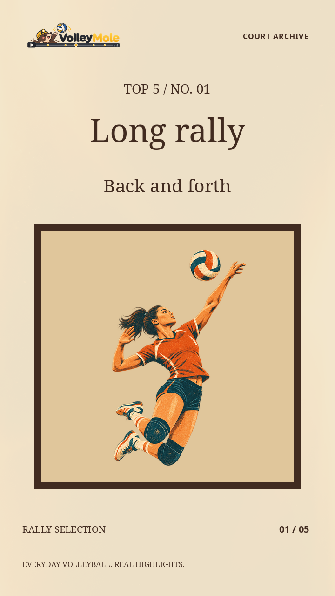

# 五套完整视觉方案

这五套不是原有插画、字体和转场的简单组合，而是独立的美术指导预设：统一标题卡构图、字级、插图比例、配色、排名标签、比赛角标、全场视角标识、回放提示、入退场运动与低音量转场音色。

选择 `--design-suite` 后，套装统一控制这些元素。原有自由搭配保留为 `custom`，不会覆盖或删除旧素材。

## 五种视觉语言

| 套装 | 一键参数 | 排版与插图 | 转场和运动 | 适合的呈现气质 |
| --- | --- | --- | --- | --- |
| 赤线竞技 | `matchday` | 石墨底、奶油白大字、赤红斜线、漫画插图；中文标题轻倾斜 | 竞技斜切、短促归位、小幅缩放 | 有力量感的比赛集锦 |
| 纸上球场 | `atelier` | 奶油纸、鼠尾草绿、陶土色；编辑式网格与剪纸插图 | 弧形纸边、轻移与错层 | 精致、温和的日常球场记录 |
| 墨间回合 | `sumi` | 宋体／衬线、水墨插图、宣纸肌理与朱砂点缀 | 水墨铺展、缓慢浮动、更多留白 | 克制、有呼吸感的回合叙事 |
| 极光棱镜 | `aurora` | 深蓝、冰蓝与冷紫；新生成的银白玻璃排球 | 光学分层揭幕、独立悬浮 | 冷色、通透的现代运动视觉 |
| 胶片纪事 | `archive` | 暖纸、棕色画框、复古丝网与衬线标题 | 琥珀光泄、微幅慢推 | 温暖、带纪实感的比赛合集 |

<p>
  
  
  
  
  
</p>

以上为实际渲染器输出的装饰性标题卡示例，并非这些动作已在某场录像中被确认。每套均有中文与英文版本；五佳、十佳及不同标题由程序准确排版。玻璃套装采用统一的排球视觉主体，不用黏土人物；其余套装按标题主题选择原有插图。

## 一键使用

```bash
# 中文：赤线竞技
.venv/bin/volleymole run \
  --video data/match.mp4 --top-k 5 --ranker rules --device cuda:0 \
  --design-suite matchday --output runs/match-matchday

# 英文：极光棱镜
.venv/bin/volleymole run \
  --video data/match.mp4 --top-k 10 --ranker rules --device cuda:0 \
  --design-suite aurora --design-language en --output runs/match-aurora-en
```

完整套装只支持 `--style lively`（主流程默认）。`--design-language zh` 为默认中文，`en` 切换套装字体、文案、名次、片头、回放和全场视角标识；品牌标志及系列英文名称保留，不翻译比赛现场声音。

套装参数优先于 `--art-theme`、`--title-template`、`--transition-style`，避免意外混入另一套视觉语言。使用完整套装时无需再指定三个单项。想恢复自由搭配，显式设置 `--design-suite custom` 并选择单项参数；`custom` 下语言由 `--title-template` 决定，不由 `--design-language` 决定。

主流程省略 `--design-suite` 时使用 `custom`，保留此前行为。直接渲染省略该参数时读取运行配置；没有新字段的旧配置仍回退到 `custom`。

## 已有项目只换设计

在原运行命令上保留其他配置，增加 `--design-suite sumi --rerun-from render`。也可直接渲染并校验：

```bash
.venv/bin/python -m volleymole.media_worker render \
  --run runs/match-top5 --style lively --workers 2 \
  --design-suite archive --design-language en
.venv/bin/volleymole verify --run runs/match-top5 --style lively
```

同一目录会替换其渲染产物；保留多套成片请先备份，或使用独立运行目录。直接渲染的显式选择不会改写旧 `run_config.json`，以本次 `render_report_lively.json` 为准；需要持续使用该选择，请保留显式参数或通过主流程保存运行配置。

检测、排名、源回合区间、慢回放速度和比赛原声不因套装而改变。套装代码与使用素材进入渲染缓存签名，报告记录 `design_suite`、`design_language`、`design_spec`、实际插图、动画版本与配色。

## 动画的克制与一致

三秒标题段保留原有结构：0.4 秒揭幕、2.2 秒完整阅读、0.4 秒退场。标题和排名在阅读区间不移动；插图使用独立图层做小幅平移或缩放，不把整张标题卡一起放大。

赤线竞技的标题倾角、赤红斜线和转场方向一致；纸艺和水墨标题卡轻量复用各自转场的材质，使揭幕后没有突然换材质的割裂；玻璃套装以新透明玻璃球呼应光学转场，避免暖色黏土与冷色玻璃混搭；胶片套装统一暖色纸面、边框和低速运动。

比赛中的名次从第一帧就完整出现，强调线在约 0.4 秒内完成展开。片头和回放提示只做短淡入，回放文字没有不透明底板；比赛角标保留大面积透明区域，仅排名使用紧凑的小标签。全场小画面、进度线也沿用套装字体和配色。

每套有两次低音量合成转场声，对应入场与退场；不同带宽和噪声音色服务于材质感，不自动添加背景音乐，不改动比赛段原声。纸艺、棱镜和悬浮均为二维合成动画，不是物理翻页模拟或实时三维渲染。

## 预览五套中英版本

### 五套英文模板

英文版本不是把中文图片替换成英文：字体、字级与换行按拉丁字形排版，片头、名次、章节、全场视角和回放提示一起切换。插画与动画继续使用对应完整套装，比赛原声不翻译。

| 英文模板 | 视觉方向 | 运行参数 |
| --- | --- | --- |
| MATCHDAY | 粗斜体、赤红强调、漫画动势 | `--design-suite matchday --design-language en` |
| COURT ATELIER | 编辑式网格、奶油纸与剪纸插画 | `--design-suite atelier --design-language en` |
| INK & MOTION | 英文衬线、宣纸留白、水墨过渡 | `--design-suite sumi --design-language en` |
| PRISM COURT | 冷色无衬线、玻璃排球、棱镜折光 | `--design-suite aurora --design-language en` |
| COURT ARCHIVE | 纪实衬线、暖纸画框、胶片光泄 | `--design-suite archive --design-language en` |

仅生成五套英文预览，默认 1080p：

```bash
.venv/bin/python scripts/preview_design_suites.py \
  --language en --quality 1080p --output outputs/english-design-suites
```

增加 `--reference-run runs/你的已完成运行` 可生成五条真实比赛短样片，每条约 9 秒，含预告、英文标题动画、比赛角标和回放。该命令仅复用已有证据，不重新分析整场、不覆盖旧成片。`--language zh` 仅生成中文，默认 `both` 生成十条双语预览；`--quality` 支持与正式成片相同的四档画质。标题卡 PNG 仍为原始 720p 设计画布。

### 双语预览

无需 GPU、模型、API 或比赛录像：

```bash
.venv/bin/python scripts/preview_design_suites.py --output outputs/my-design-suites
```

打开生成的 `index.html`，切换中文／English，观看十段设计预览。每套还包含标题卡、另一动作版式、实际角标、片头／回放透明图和动画帧时间线。输出目录必须是新目录。

已有完整运行时，可复用其证据制作十段短实拍呈现样片：

```bash
.venv/bin/python scripts/preview_design_suites.py \
  --output outputs/my-real-design-suites --reference-run runs/match-top5
```

如果原片移动过，增加 `--source path/to/match.mp4`，脚本会对比证据记录的字节数与 SHA-256。实拍样片复用首个入选回合的两秒片段，通常为九秒（片头 1 秒 + 标题 3 秒 + 比赛 2 秒 + 慢回放 3 秒）；这只用于看设计，不会改写参考运行的剪辑单，也不代表重新推理或完整排名验收。

## 素材与验证

原有五套插图和转场 PNG 保留；新玻璃排球通过 imagegen 技能调用 Codex 内置 `image_gen` 生成，保留原始透明通道，未使用 CLI/API 回退。原图及完整提示词、哈希位于 [design_suites 素材记录](../src/volleymole/assets/design_suites/prompts.json)。程序只做运行时等比缩放、透明边界适配、排版与合成，不修改生成原图，也不改动用户提供的品牌标志。

标题动画校验按确定性的实际动画帧重建预期图，不拿静止图去误判轻微插图运动；仍使用原有编码误差阈值。同时检查文字区域在阅读期间逐像素稳定、所有名次可区分、角标透明区与回放提示。

本次检查包括 103 项单元测试、十段实拍样片、十段无录像设计样片完整解码，以及五套 × 中英 ×（五佳 5 个名次 + 十佳 10 个名次）= 150 个名次经过两次 H.264 编码后的识别校验。样片检查不等于动作识别准确率或全场排名质量结论。

另以 `aurora` 英文版复用原有证据和未经裁短的五个完整入选回合，完成一次正式渲染及 `verify` 验收：时间线、所有片段／成片完整解码、源声音对齐、动态标题、名次和顶部真实比赛画面检查均通过。该次验收没有重新执行模型推理或重新排名；其他四套已完成上述双语样片与编码检查。
