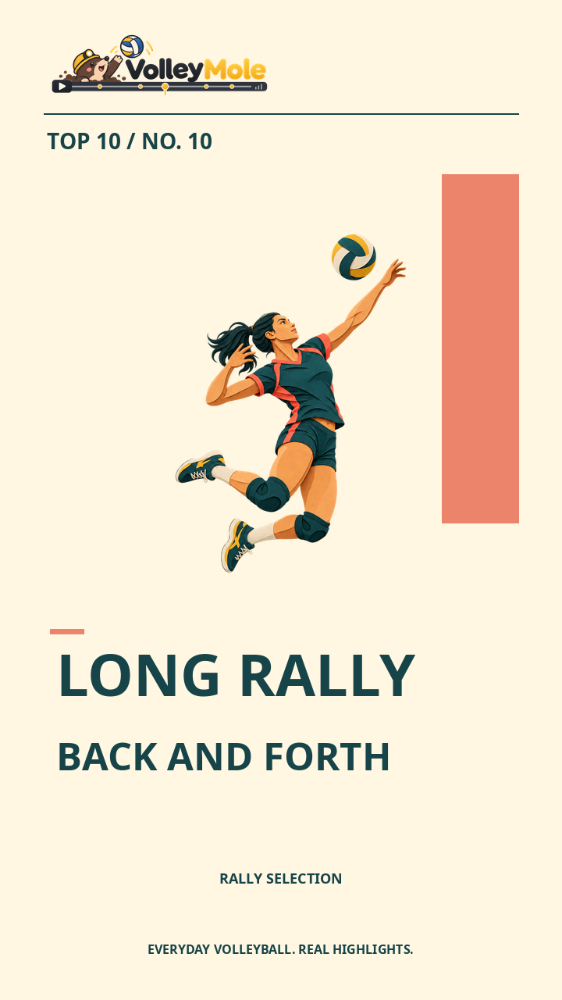
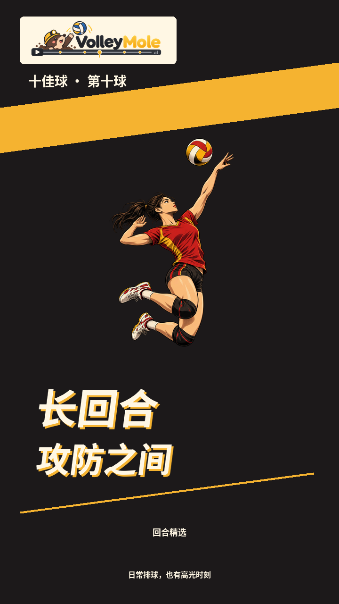
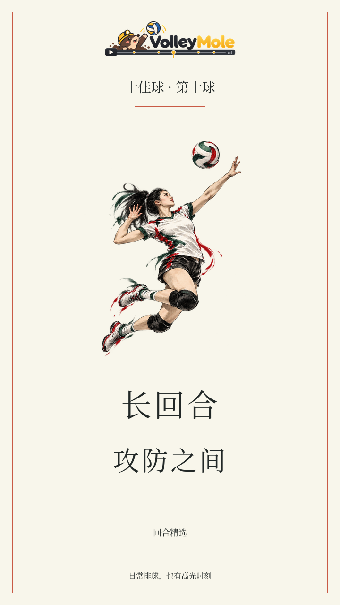
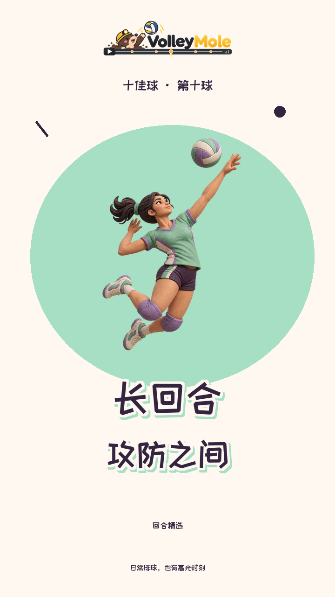
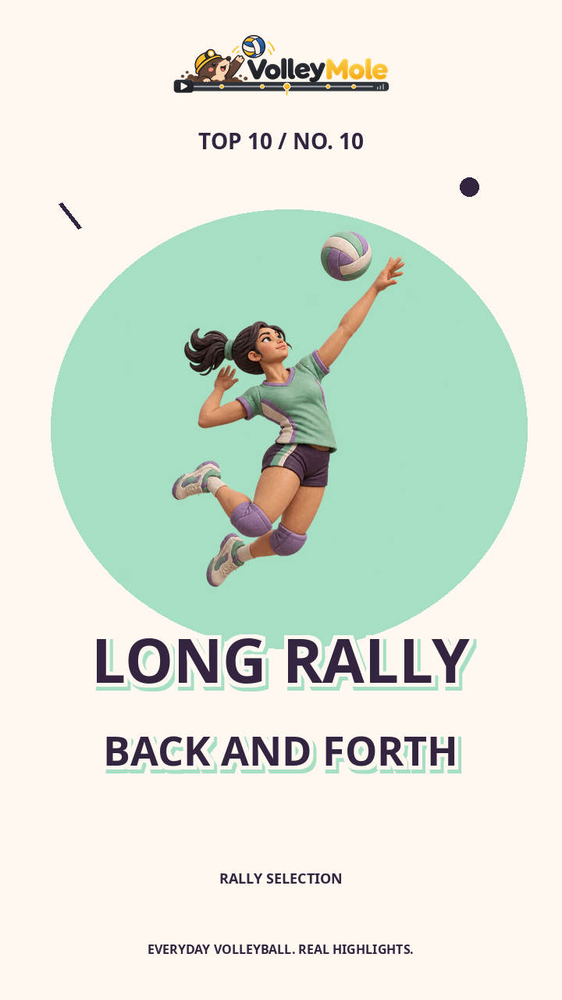
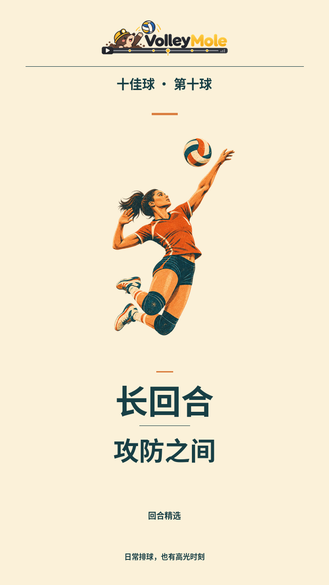
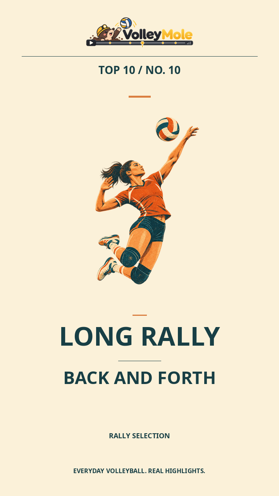

# 中英双语标题模板

五组标题系统，各有中文和英文版本，共十套。字体、标题层级、字距、断行、强调方式与标题卡构图一起切换；不依赖固定文字图片，因此五佳、十佳及不同回合均可准确排版。

## 十套模板

| 设计 | 中文参数 | 英文参数 | 设计语言 |
| --- | --- | --- | --- |
| 刊物编辑 | `editorial-zh` | `editorial-en` | 粗黑体、左对齐、主副标题层级、色块与细线 |
| 竞技速报 | `arena-zh` | `arena-en` | 深底、斜向构图、速度感字形、短距离偏移阴影 |
| 电影片名 | `cinema-zh` | `cinema-en` | 宋体／衬线、舒展字距、居中与留白 |
| 潮流贴纸 | `pop-zh` | `pop-en` | 手写／粗体、奶油色描边、偏移色影、大色面 |
| 极简栏目 | `minimal-zh` | `minimal-en` | 几何黑体、稳定轴线、克制分隔线与字级 |

默认 `legacy` 保留此前的手写标题和文案，不会自动改变已有项目的设计。

## 中英对照图集

以下为实际渲染器输出，左为中文、右为英文。每组演示一种插画搭配，十套模板均支持自由换装。

### 刊物编辑

<p>
  
  
</p>

### 竞技速报

<p>
  
  
</p>

### 电影片名

<p>
  
  
</p>

### 潮流贴纸

<p>
  
  
</p>

### 极简栏目

<p>
  
  
</p>

## 使用

```bash
# 中文：刊物标题 + 剪纸插画
.venv/bin/volleymole run \
  --video data/match.mp4 --top-k 5 --ranker rules --device cuda:0 \
  --art-theme papercut --title-template editorial-zh \
  --output runs/match-editorial-zh

# 英文：竞技标题 + 漫画插画
.venv/bin/volleymole run \
  --video data/match.mp4 --top-k 10 --ranker rules --device cuda:0 \
  --art-theme manga --title-template arena-en \
  --output runs/match-arena-en
```

`--title-template` 与 `--art-theme` 是独立选项：十套标题可与五套新插画组合为 50 种呈现，也兼容原版插画。仅适用于 `--style lively`，不改变比赛检测、剪辑区间、分辨率、帧率、原声或编码画质参数。

已有完整运行只换标题，可在原命令上保留其他配置并增加 `--title-template cinema-en --rerun-from render`。直接渲染也支持此参数：

```bash
.venv/bin/python -m volleymole.media_worker render \
  --run runs/match-top5 --style lively \
  --art-theme ink --title-template cinema-en --workers 2
.venv/bin/volleymole verify --run runs/match-top5 --style lively
```

同一目录的渲染产物会被替换，保留多个版本请使用独立目录或先备份。主流程省略参数采用 `legacy`；直接渲染省略参数时读取 `run_config.json`，旧配置回退至 `legacy`。渲染报告记录 `title_template`，校验按报告恢复正确语言和字体，所选模板代码与字体也纳入渲染缓存校验。

## 英文不是直接替换中文字体

英文模板使用独立的 Noto Sans、Noto Sans Bold Italic 和 Noto Serif。针对词长独立设置字级与断行；电影版采用句式大小写，其余使用标题大写。主标题、排名、片头、副标题、回放与页脚都采用英文，例如：

| 内容 | 中文 | 英文 |
| --- | --- | --- |
| 十佳第十球 | 十佳球 · 第十球 | TOP 10 / NO. 10 |
| 长回合标题 | 长回合／攻防之间 | LONG RALLY / BACK AND FORTH |
| 二传标题 | 二传组织／衔接之间 | THE SET / CONNECTING PLAYS |
| 回放提示 | 精彩回放 | REPLAY |

新模板文案来自本地、受证据约束的短句映射，不调用额外 API；不杜撰得分、胜负或球员身份。它们是可复用的呈现文案，不是对任意剪辑单的通用翻译。原始 `edit_decision.json` 的标题和理由不被改写；英文模板仅改变视频上的显示文字，比赛现场的中文声音不翻译。

## 离线预览

```bash
.venv/bin/python scripts/preview_title_templates.py --output outputs/title-templates
```

在浏览器打开 `index.html`，可并排比较中英版本，并从顶部切换插画与配色。每套输出五种插画组合的标题卡、另一种回合标题、全部 15 个五佳／十佳角标以及片头和回放透明层。小角标预览固定使用漫画配色。输出目录必须是新目录，以免覆盖旧审稿版本。

预览和程序输出使用同一套排版代码；不是 AI 生成的固定文字贴图。原始插画 PNG 不被修改。

## 验证记录

十套模板完成 50 种插画组合及第二种标题的版式预览。87 项自动化测试通过，覆盖默认兼容、语言切换、模板隔离、长标题安全区、透明角标、配置恢复及英文时间线校验。全部 150 个五佳／十佳中英排名角标经过 x264 CRF 20 → CRF 19 两次压缩后，均通过生产校验器同一名次模板区域和阈值的识别检查。

另以同一段已有比赛素材制作十个 9 秒实片短样，均通过完整解码、标题卡及排名文字像素检查。短样没有重跑推理／排名，不等同于十次整场端到端验收；本地视频不随仓库分发。

## 字体与分发

新增字体随包安装，正常运行不依赖本机字体发现或下载服务。中文使用 Noto Sans CJK SC Bold、Noto Serif CJK SC Regular 及已有站酷快乐体；英文使用独立 Latin 字体。CJK SC 字面从系统 Noto 集合中完整提取，保留字形与字体元数据，未按几条示例文案裁剪字库。

字体保持其 SIL OFL 1.1 许可，不属于项目代码的 MIT 授权。完整来源和许可保留在 `assets/fonts/NOTICE-Noto-CJK.txt`、`NOTICE-Noto-Core.txt` 与已有站酷字体许可中。开发用提取脚本 `scripts/prepare_title_fonts.py` 需要 FontTools；正常运行不需要执行该脚本。
