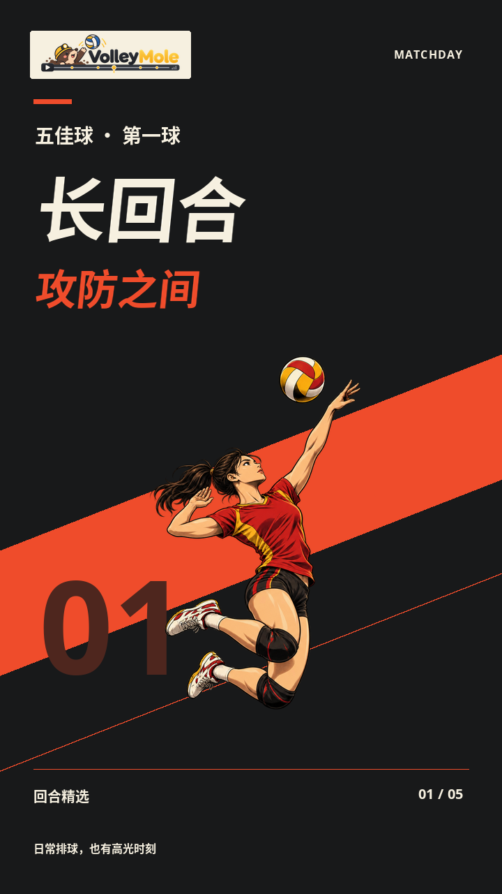
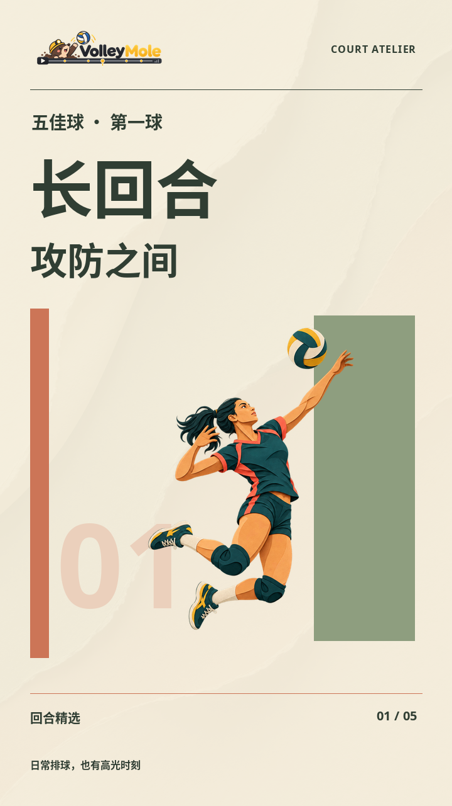
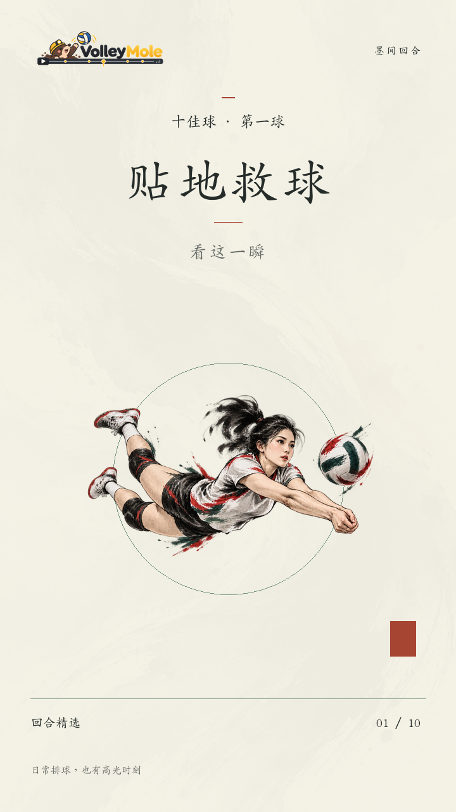
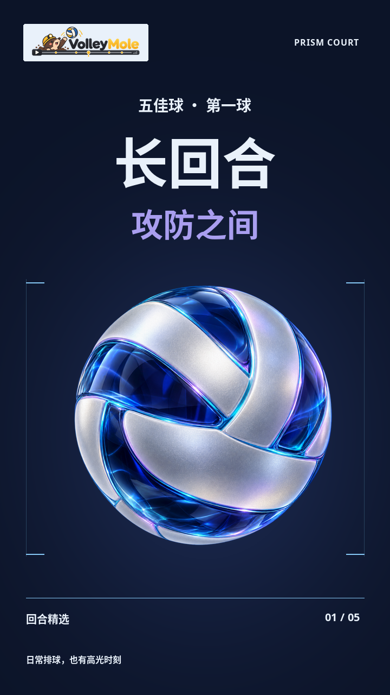
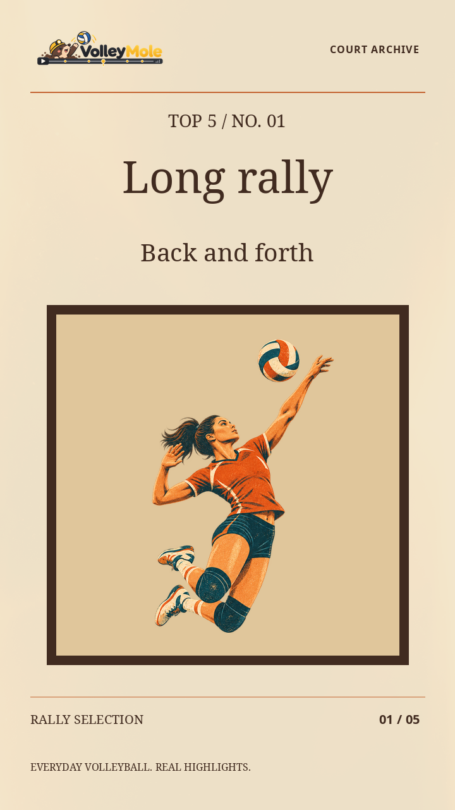

# 模板与配音

适用版本：VolleyMole v0.3.0；更新日期：2026-09-30。日常操作见[使用指南](README.md)，选球方法见[自动化原理](自动化剪辑原理与流程.md)。

<a id="template-library"></a>

## 统一模板库

所有模板归入项目根目录 `templates/`，默认位置不随启动命令的工作目录变化。

| 目录 | 内容 |
| --- | --- |
| `builtin/` | 五套内置 JSON，随应用发布 |
| `custom/` | 个人 JSON，CLI 导入和网页保存写入这里 |
| `bundles/<版本>/`、`<版本>.zip` | 封存源码、字体、素材和配置的定稿包 |
| `bundles/<版本>.sha256`、`.validation.json`、`.tests.log` | 校验值和验证记录 |

内置配置和说明随 Git 发布，个人配置与本机定稿包不提交。`VOLLEYMOLE_TEMPLATES` 或 `templates --directory` 可指定整座库；网页使用当前工作区的 `templates/`。独立安装默认使用 `$XDG_DATA_HOME/volleymole/templates/`，未设置时为 `~/.local/share/volleymole/templates/`，首次复制内置预设且不覆盖已有文件。

旧平铺个人 JSON 兼容读取，新保存进入 `custom/`。临时预览仍放 `outputs/`，不作为正式模板来源。

<a id="custom-template"></a>

## 创建、切换与覆盖

```bash
volleymole templates list
volleymole templates show sumi
volleymole templates export sumi --name my-team --output my-team.json
# 编辑 JSON 后导入，再按名称使用
volleymole templates import my-team.json
volleymole run --video data/match.mp4 --ranker rules --template my-team
```

也可直接传 `--template ./my-team.json`。内置名称保留，导入不覆盖同名文件，可用 `--name` 改名。已完成任务可用 `templates export --from-run runs/my-match --name my-team-v2 --output my-team-v2.json` 导出配置。

`options` 用于剪辑，`audio` 用于成片后混音。模板不保存视频路径、输出目录、设备、模型路径或密钥。

```json
{
  "version": 1,
  "name": "my-team",
  "description": "我的球队 · 水墨 · 中文",
  "options": {
    "style": "lively",
    "design_suite": "sumi",
    "design_language": "zh",
    "quality": "1080p",
    "replays": true,
    "replay_speed": 0.6666666666666666,
    "replay_review": "auto"
  },
  "audio": {"enabled": true, "max_cues": 2, "rms_db": -20, "duck_db": -3}
}
```

优先级：**显式 CLI 参数 > 模板 > 程序默认值**。`version`、`name`、非空 `options` 必填，未知字段或无效值报错。最终参数和快照保存到任务的 `run_config.json`。

| 选项 | 可用值／说明 |
| --- | --- |
| `style` | `lively`、`classic`；经典模式不使用 lively 的设计套装 |
| `design_suite` | `matchday`、`atelier`、`sumi`、`aurora`、`archive`、`custom` |
| `design_language` | `zh`、`en` |
| `quality` | `720p`、`1080p`、`1440p`、`2160p` |
| `replays`、`replay_speed` | 回放开关、0.5–1.0 倍速 |
| `replay_review` | `auto`、`required`、`off`，关闭回放不能同时要求 `required` |
| `top_k` | 5 或 10，省略沿用入口默认值 |
| `collection`、`analysis_mode`、`ranker` | 榜单、分析路线、排名方式，见使用指南 |
| `focus_player` | 关注球衣号码 |

还支持回放预算、并发、采样和扩窗选项，字段名将 CLI 连字符换成下划线。完整范围见 [templates.py](../src/volleymole/templates.py) 和 `run --help`。模板不代替分析和复核，也不自动执行配音。

<a id="design-suites"></a>

## 五套完整设计

| 模板 | 名称 | 特点 |
| --- | --- | --- |
| `matchday` | 赤线竞技 | 漫画动势、粗体标题、斜切转场 |
| `atelier` | 纸上球场 | 剪纸插画、编辑式排版、纸艺转场 |
| `sumi` | 墨间回合 | 楷体题签、宣纸留白、水墨转场 |
| `aurora` | 极光棱镜 | 冷色玻璃排球、简洁文字、棱镜转场 |
| `archive` | 胶片纪事 | 暖色纪实排版、复古插画、胶片光泄 |

预览直接复用网页图片，不在文档目录复制另一套：

<p>
  
  
  
  
  
</p>

完整套装统一字体、配色、插画和转场。英文版调整字体与布局，不翻译原声、不改原剪辑单。当前正常回合、预告与回放都是单画面跟球竖屏，没有常驻底部全场小窗或分屏。

<a id="illustrations"></a>
<a id="titles"></a>
<a id="transitions"></a>

### 自由搭配与预览

自由组合需要 `design_suite: custom`：

| 类别 | 参数 |
| --- | --- |
| 插画 `art_theme` | `default`、`manga`、`clay`、`papercut`、`ink`、`retro` |
| 标题 `title_template` | `legacy`；或 `editorial`、`arena`、`cinema`、`pop`、`minimal`、`sumi` 加 `-zh`／`-en` |
| 转场 `transition_style` | `fade`、`velocity`、`paper`、`ink`、`prism`、`film` |

```bash
volleymole run --video data/match.mp4 --ranker rules \
  --design-suite custom --art-theme manga --title-template arena-zh \
  --transition-style velocity --output runs/custom-design

python scripts/preview_design_suites.py --language both --output outputs/design-preview-new
python scripts/preview_title_templates.py --output outputs/title-preview-new
python scripts/preview_art_themes.py --output outputs/art-preview-new
python scripts/preview_transitions.py --output outputs/transition-preview-new
```

预览使用生产绘制代码，不运行比赛分析或 API；动画预览需要 FFmpeg 和已安装素材，输出使用新目录。完整套装脚本支持 `--reference-run` 制作已有比赛短样片，短样不等于整场验收。其余选项见各脚本 `--help`。

插画是装饰，不能当作动作识别证据。转场由程序驱动原始材质的遮罩和缓动，是二维合成；每次剪辑不重新调用生图服务。

<a id="sumi"></a>

## 水墨 v2.0.0 定稿

2026-09-30 确认版采用 **AR PL UKai CN 楷体**，副题缩小、增加留白，名次标签浅色底，角标和回放提示细描边。字体、字距、配色、排版与动画代码随包固定。

本机位置为 `templates/bundles/sumi-v2.0.0/` 和同名 ZIP，校验与验证记录在旁边。`preview.png` 是确认图，`manifest.json` 记录依赖和逐文件 SHA-256。包包含源码、配置、字体、许可证和呈现素材，不含录像、分析结果、模型、环境或密钥。

当前工作区用 `--template sumi`；跨代码版本精确复现时使用封存入口：

```bash
.venv/bin/python templates/bundles/sumi-v2.0.0/sumi.py --verify
.venv/bin/python templates/bundles/sumi-v2.0.0/sumi.py --preview outputs/sumi-confirmed.png
.venv/bin/python templates/bundles/sumi-v2.0.0/sumi.py run \
  --video data/match.mp4 --ranker rules --output runs/sumi-frozen
```

支持 `run`、`match`，自动带入封存配置和字体，显式参数仍可覆盖剪辑设置。默认中文、1080p、2/3 倍回放；配音配置上限为两处，需另行执行配音步骤。回放区间与梗位置仍由当次任务决定。

迁移先 `--verify` 再 `--preview`，后者重绘并与确认图逐像素比较。预览不要写进包内；剪辑仍需 Python 3.12 依赖、FFmpeg 和模型。

旧包及历史说明保持原样，旧路径以当前模板库位置为准。新定稿另存版本，`scripts/freeze_sumi_template.py` 拒绝覆盖同名包。`outputs/template-sumi-v2/` 是历史预览，不是正式模板位置。

<a id="fonts"></a>

## 字体与缺字

`fonts/ukai.ttc` 和 ARPHIC PUBLIC LICENSE 随 `assets-v2` 分发，Noto、站酷字体保留各自许可，见 [THIRD_PARTY.md](../THIRD_PARTY.md) 和素材内声明。

渲染前检查字体能否加载、字形是否覆盖整段文字。缺失、损坏或缺字时尝试备用字体；仍不能覆盖就报错，不删字、不输出方框。水墨回退到其他衬线字体时不保证定稿字形。

当前一款字体覆盖整段文字，不逐字混搭。报告记录实际字体、字面编号和回退；同路径字体内容改变也使相关缓存失效。旧缺字成片需重渲染，不必重做相同模型分析。

<a id="assets"></a>

## 素材安装与分发

固定版本 [assets-v2](https://github.com/rudykon/VolleyMole/releases/tag/assets-v2) 约 99.4 MiB，包含字体、插画、转场和品牌素材。模型、录像、用户配音独立管理。

```bash
volleymole assets fetch
volleymole assets verify
# 联网机器下载固定包后，可在目标机器离线导入
volleymole assets import-file /path/to/volleymole-assets-v2.zip
```

默认安装到 `${XDG_CACHE_HOME:-~/.cache}/volleymole/assets/assets-v2/`，检查 ZIP 与逐文件 SHA-256 后才发布目录。渲染依次查找 `VOLLEYMOLE_ASSETS`、固定版本用户缓存、本地开发素材，不自动联网下载。

命令支持 `--directory`，后续运行仍需将 `VOLLEYMOLE_ASSETS` 指向该位置，根目录直接包含 `fonts/`、`illustrated/`、`transitions/`。损坏目录会报错并保留，可备份移走后重装。

维护者用 `python scripts/build_asset_bundle.py --version <新版本> --output dist/<新版本>` 构建新包并同步固定清单；脚本不上传。已发布版本和封存包不覆盖。素材来源、字体许可继续保留，不因文档合并而删除。

<a id="meme-local"></a>

## 本地混音

`meme-audio` 按明确时间表混入本地素材，保留视频码流，不调用大模型。第三方配音素材放用户的 `data/`，不随源码或视觉素材包分发。

```json
{
  "version": 1, "max_cues": 2,
  "selection_mode": "explicit_editorial_times",
  "cues": [{
    "id": "nice", "asset": "meme-assets/nice.wav", "at_sec": 12.5,
    "source_start_sec": 0.0, "source_end_sec": 0.9,
    "rms_db": -20, "duck_db": -3
  }]
}
```

示例时间须按实际素材填写。路径相对计划文件；`at_sec` 是成片时间，`source_*` 是音频素材的完整短句区间。

```bash
volleymole meme-audio --video outputs/approved.mp4 \
  --plan data/meme-plan.json --template sumi --output outputs/with-memes.mp4
```

单条区间 0.1–5 秒，重叠、越界或超上限报错，不强行截句。默认最多两处，可用空计划复制原片。模板混音设置覆盖计划，显式 CLI 再覆盖模板：

| 字段 | 范围／含义 |
| --- | --- |
| `enabled` | false 时复制原成片 |
| `max_cues` | 1–20，超出先修改计划 |
| `rms_db` | -36 至 -14 dB，配音电平 |
| `duck_db` | -12 至 0 dB，配音期间原声增益 |

输出 `.audio.json` 保存来源、时间、增益和视频码流检查。混音版需检查峰值与听感，不能当作原声未改的文件验收。

<a id="meme-director"></a>

## API 选梗与时机

`meme-director` 是成片后的独立入口，没有默认接入 `run` / `match`。先准备原片与成片回放的映射，再抽帧、选梗、生成混音计划。

映射示例中的时间仅用于说明格式：

```json
{
  "version": 1, "video": "approved.mp4", "assets": "meme-assets.json",
  "clips": [{
    "id": "rally_01", "source": "original_match.mp4",
    "source_start_sec": 10.0, "source_end_sec": 13.0, "peak_sec": 11.0,
    "context_start_sec": 9.4, "context_end_sec": 13.6,
    "output_start_sec": 20.0, "output_end_sec": 24.5,
    "playback_rate": 0.6666666666666666,
    "editor_constraints": {"action": "tip", "forbidden_memes": ["kaipao"]}
  }]
}
```

素材清单形如 `{"assets":[{"id":"nice","kind":"audio","ready":true,"path":"nice.wav","source_start_sec":0.0,"source_end_sec":0.84,"rms_db":-20}]}`。路径相对各自清单，每段上下文最多 8 秒；人工动作纠正应绑定对应原片与区间。

```bash
volleymole meme-director prepare --manifest data/meme-review-manifest.json --run runs/meme-review
volleymole meme-director run --run runs/meme-review --llm-config llm_api.json \
  --max-calls 4 --render-output outputs/with-api-memes.mp4
```

`prepare` 只本地抽帧；实际 `run` 按明确的素材上传和调用范围执行。默认 `qwen3.5-35b-a3b` 走 AiHubMix Chat 接口。Gemini 仅在显式指定 `--protocol gemini --model gemini-3.1-pro-preview` 时使用，不自动换昂贵模型。

默认 12 FPS、1280 像素宽准备真实画面，触球附近密集采样，保留同一时刻的全景与局部；只发送截图和规则，不发送原视频或音频。模型返回用／不用、动作事实、引用帧、梗与开始时刻，程序验证后映射到慢放时间。

规则有 13 种，只有已具备本地素材的项参与选择。核对时已入库 nice、开炮，其余规则不等于已有音频：

| 梗 | 使用情节 |
| --- | --- |
| 开炮 | 明确强力挥臂、触球与迅猛出球的重扣；吊球或力度不明禁用，并追加独立核验 |
| 救救我救救我 | 极限追球、来不及或接力救险 |
| 土拨鼠尖叫 | 无伤痛的突发险情或夸张救回之后 |
| 牛逼 | 有明确成功结果的高难动作或高质量对抗 |
| 消音版退钱 | 明显非受迫失误且有友好自嘲 |
| 电视没信号 | 意外失误后确有喜剧停顿 |
| nice | 干净救球、巧妙吊球、落点或配合成功之后 |
| 黑人问号 | 比赛情节引发可见困惑，不能由外貌或身份触发 |
| 曹操笑声 | 回合结束后的友好欢乐反应 |
| 真香 | 有编辑提供前情的先否定后成功反转 |
| 我的天哪 | 濒临落地救回或连续救险逆转等意外成功 |
| 一个字，绝 | 漂亮处理的完整结果出现之后 |
| 刺激 | 上下文充分的紧张多拍结束后 |

详细执行条件见 [meme_policy.json](../src/volleymole/meme_policy.json)。疑似受伤、痛苦、羞辱与判罚争议等排除条件优先。默认每回合最多一处、同梗不重复、至少间隔 6 秒，保护触球前后 0.15 秒，整句须位于回放内；不要求用满数量。

调用次数发送前持久化预占，失败即停，重启不重置预算；相同成功请求可复用。不确定就跳过，模型置信度不等于实测准确率，最终仍需观看与试听。
