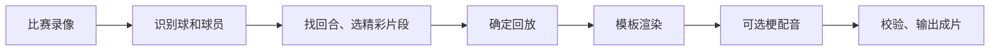

# VolleyMole 自动化剪辑原理与流程

本文按 **VolleyMole v0.3.0** 的实际实现整理，说明从比赛录像到成片的主要步骤，以及各阶段使用的方法、模型和 API。配置与本地案例核对日期：**2026-09-30**。模型名称属于当时的配置或模块默认值，可以调整，不代表每次任务都实际调用了这些模型。

操作命令见[使用指南](README.md)，设计与配音见[模板与配音](模板与配音.md)，准确性和性能证据见[开发与验证](开发与验证.md)。

## 整体流程

系统由 Python 串联各个处理阶段：**本地模型提取比赛信息，大模型辅助判断精彩动作，剪辑程序负责切片、回放、排版、混音和导出。** 水墨等成片模板主要控制呈现方式。



完整过程可以分成八大步骤：

| 步骤 | 核心问题 | 主要方法／工具 | 是否调用外部 API |
| --- | --- | --- | --- |
| 1. 读取录像 | 视频有哪些画面，它们发生在什么时间？ | FFprobe、PyAV、原始时间戳 | 否 |
| 2. 本地识别 | 球在哪里、球员在做什么、比赛是否进行中？ | VideoMAE、YOLO、VballNet | 否 |
| 3. 回合定位 | 一球从哪里开始，到哪里结束？ | `fused_v2` 规则与运动证据融合 | 否 |
| 4. 精彩筛选 | 哪些回合或事件值得入选？ | 规则评分、可选语义排序或事件理解 | 视分析模式而定 |
| 5. 回放复核 | 最值得重看的动作是哪几秒？ | 连续画面复核、独立核验、边界检查 | 自动视觉复核时调用 |
| 6. 模板渲染 | 如何构图、排版并组织时间线？ | OpenCV、NumPy、Pillow、FFmpeg、模板素材 | 否 |
| 7. 梗配音 | 用什么梗，放在什么时刻？ | 可选 API 选梗、本地素材混音 | API 选梗时调用；混音不调用 |
| 8. 校验与保存 | 成片是否按计划正确生成？ | 解码、音画对齐、字体及时间线检查、缓存 | 否 |

## 1. 读取录像，建立统一时间轴

输入可以是一段视频，也可以是某一天的多局录像。单视频入口是 `run`；多局入口是 `match`，会分别分析各局，再合并选择整场十佳球。

这一阶段使用：

- **FFprobe**：读取分辨率、帧率、时长、音轨和画面旋转信息。
- **PyAV**：解码视频，取得每一帧画面及其原始时间戳。
- **Python**：记录文件身份、整理来源信息、安排后续任务。

最关键的是时间戳。例如某次扣球发生在原片第 185.24 秒，后面的动作识别、截取、慢放和原声都要对准这个时间，不能简单假设所有录像都是每秒 30 帧。

多局录像各自保留原片时间：第 2 局的第 10 秒与第 1 局的第 10 秒属于不同来源。入选片段直接从对应原片渲染，不需要先把所有录像转码拼成一条。

这一步在本地完成，不调用大模型 API。多局组织方式见[整场多局十佳球](README.md#match)。

## 2. 用本地模型识别比赛信息

系统让几个模型分别完成明确的任务，再汇总结果。

| 模型／方法 | 负责什么 | 在后续剪辑中的用途 |
| --- | --- | --- |
| **VideoMAE** | 根据连续画面，判断正在比赛、非比赛、发球，即 `play`、`no-play`、`service` | 帮助区分有效比赛和等待时间 |
| **YOLO 动作检测模型** | 提供接球、二传、扣球、拦网等动作候选 | 提示哪里可能有值得关注的动作 |
| **YOLO 人物／姿态模型** | 检测球员位置，并在支持时输出身体关键点 | 判断参与人数、人物位置，辅助分析动作 |
| **VballNet seq9** | 连续读取 9 帧灰度图，估计球的位置 | 建立球的运动轨迹，供回合定位和跟球构图使用 |
| **YOLO 球检测模型** | 提供额外的球位置候选 | 在满足连续性条件时补充主追踪结果 |

这些模型使用本地权重，通过 **PyTorch、Ultralytics、ONNX Runtime** 等运行，可以使用 GPU。共享推理模式会把同一批解码画面提供给多个模型，减少重复读取录像。

**检测到“疑似扣球”只是一条候选证据，还不能证明这是一次精彩重扣或成功得分。** 小球遮挡、远景、多人重叠都会影响识别。

另外还有两个可选模块：

- **PANNs 声音事件模型**：给事件理解路线提供笑声、掌声等候选证据。声音类别和音量大小是不同概念；听到笑声也不等于能证明笑声由当前动作引起。
- **ResNet18＋双向 GRU 动作定位模型**：本项目的实验性动作定位模块，需要显式生成并导入动作证据，不是每次默认运行。

代码入口：[状态识别](../src/volleymole/state_model.py)、[目标检测](../src/volleymole/detectors.py)、[球轨迹追踪](../src/volleymole/tracker.py)。可选模块见[声音模型部署](开发与验证.md#sound)和[本地排球动作定位](开发与验证.md#action-model)。

## 3. 把零散识别结果合成完整回合

上一阶段得到的是带时间的记录，例如：

> 这一刻处于比赛状态；球在这个位置；场上检测到若干球员；这里出现了疑似接球动作。

这一阶段要回答：**一球从哪里开始，到哪里结束？**

当前使用本地规则融合算法 `fused_v2`，综合判断：

- 球是否持续运动，轨迹是否可信。
- 球相对球员的位置，是否存在低球救险。
- 比赛状态和动作检测结果。
- 短暂丢球是否可以连接，两个回合是否应该分开。

算法默认按 **0.5 秒**的时间格汇总证据，连接合理的短缺口，同时尽量排除持球走动、等待等情况。比赛状态分类只是辅助信息，不能仅凭一个 `play` 标签就认定球正在进行有效攻防。

找到回合后，默认向前保留 **1.8 秒**、向后保留 **2 秒**，并限制与相邻回合重叠，给观众保留准备动作和结束反应。

输出是 `match_manifest.json`：所有候选回合的清单，包含原片位置、起止时间、轨迹质量、动作候选等。这一步主要靠算法和规则，不需要大模型 API。

代码与参数：[rally.py](../src/volleymole/rally.py)、[defaults.json](../src/volleymole/defaults.json)。

## 4. 从候选中选择精彩片段

系统有两条分析路线。**当前默认十佳球采用完整回合路线；事件理解是可选路线。**

### 4.1 默认路线：完整回合预筛、语义排序与规则兜底

首先做规则评分，考虑回合持续时间、有效球运动、轨迹转折、动作数量、球员参与度等。

程序先挑出较好的候选。默认十佳球通常将规则分最高的 **25 个有效回合**作为候选池；有效回合较少时使用实际数量，候选上限也可以配置。没有足够的有效、不重叠回合时，完整回合路线会报错，不强行补满。

启用 API 排序后，每个候选的结构化信息和 **开始、峰值、结束三张关键帧**会发给模型。模型返回：

> 选哪些回合、如何排名、每球标题是什么、为什么入选。

核对时本地配置的主模型是 **`glm-5.3-flash`**，通过 **AiHubMix 的 OpenAI 兼容接口**调用，主要请求路径为 `/chat/completions`。“OpenAI 兼容”指接口格式，实际调用哪个模型由配置决定。

也可以明确指定独立视觉模型：先看图生成评审，再交给主模型排序。

模型返回的 JSON 必须符合指定结构，并通过本地检查：不能选择不存在的回合，不能越过允许的时间边界。排序结果保存为 `edit_decision.json`，它是一份剪辑单，后续程序照单渲染。

API 未配置、失败或返回无效结果时，这条路线会退回规则排序，并在 `ranking_log.json` 记录原因。显式使用 `--ranker rules` 则直接采用规则排序。

三张关键帧能提供有限的语义信息，不能等同于模型连续看完了整个回合。代码见 [ranker.py](../src/volleymole/ranker.py)。

<a id="events"></a>

### 4.2 可选路线：全场事件理解

显式指定 `--analysis-mode events`，或在默认 `auto` 分析模式下选择趣味榜、双榜，会启用事件路线。仅设置 `--ranker auto` 不会自动启用它。

这条路线看得更密：

- 默认把整场分成 **24 秒**的小段，相邻重叠 **4 秒**。
- 先每秒抽 **2 帧**粗看，再对候选每秒抽 **8 帧**复核。
- 按配置发送连续图片及同步音频，或仅发送图片；音频输入要求服务支持相应接口。
- 理解模型返回动作、前后过程、反应，以及九个维度的评分；程序再计算精彩榜、趣味榜。

精彩榜的维度包括动作价值、攻防、难度变化、运动强度和相关反应；趣味榜的维度包括意外反差、相关笑声、叙事和球员反应。这里由程序组合分数，不再让文本模型做一次最终“大排名”。

事件路线不受前述规则前 25 名预筛限制。模型必须引用实际提供的帧编号，由程序转换成原片时间，减少模型随口编时间的问题。候选证据不够时，可以少出片段，不会强行凑十个；请求失败也会与有效的空结果区分记录。

它适合更细的动作和趣味事件分析，但请求更多，仍可能漏判、误判。默认十佳球并不会自动运行这条路线，启用方法见[分析模式](README.md#api)。

**事件接口与本地约束。** 请求采用 `response_format: json_schema` 和严格字段协议 `frame_anchors_v3`。模型返回动作起止、剪辑起止和峰值的五个实际帧编号，事实引用已有帧或同时段辅助证据；程序用原始 PTS 转换到本地 canonical 时间格式。顺序错误、未知帧、缺字段、评分无证据、截断或非法 JSON 均拒绝，不补造答案。

九维分数采用 0–4 或未知 `null`，非未知项需关联事实。程序按已观察维度归一化，默认已观察权重至少 60%、得分至少 55 才可入选；精彩榜保留完整回合，趣味榜保留铺垫、意外和反应。去重并排除重叠，趣味榜最多五段，零段只写报告，不生成空视频。具体权重以 [defaults.json](../src/volleymole/defaults.json) 为准。

同一次请求只接受完整响应，有限重试共用预算；失败与合法空事件分别保存。`analysis_status` 区分 `complete`、`partial`、`failed`、`not_configured`。多局任一分析不完整时，汇总标记 `analysis_incomplete`，不能据零事件断言整场没有精彩内容。采样、模型、源文件和协议变化均影响语义缓存。

### 4.3 API 配置与实际使用的区别

| 名称 | 在本项目中的角色 | 是否每次剪辑都运行 |
| --- | --- | --- |
| `glm-5.3-flash` | 核对时 `llm` 节点配置的主模型；供语义排序、事件理解或回放复核按配置使用 | 否，取决于模式、配置和阶段 |
| 显式指定的 `vision_model` | 独立视觉评审，或优先用于事件理解及回放复核 | 否，需要配置 |
| `bge-large-zh` | 核对时存在于配置的 `rank` 节点 | 当前主剪辑流程没有使用该节点进行生成式排序 |
| `qwen3.5-35b-a3b` | 独立梗配音导演模块的默认模型 | 否，只在相应 API 选梗阶段运行 |

配置文件里存在某个模型，不等于一条成片实际调用过它。应以对应任务的阶段记录为准。

<a id="replay"></a>

## 5. 为每一球确定慢动作回放

选中完整回合以后，还需要单独确定：**这一球最值得重看的具体过程是哪几秒？**

自动回放复核会依次：

1. 扫描入选回合，寻找值得回放的动作。
2. 抽取连续画面和同一时刻的局部放大图。
3. 检查准备、触球及后续过程是否完整。
4. 再发起一次不提供首轮答案的独立核验。
5. 检查边界，把通过的起止时间写入回放记录。

这一阶段使用配置的视觉模型；没有单独指定时使用主模型。独立核验是另一轮请求，不一定是另一个模型，因此仍不能当作绝对正确的保证。

默认慢放为 **2/3 倍速**。例如原片 3 秒的动作，慢放后约为 4.5 秒。

| 回放复核设置 | 行为 |
| --- | --- |
| `auto` | 自动安排复核；无法确认的回放可能省略。规则排名默认不发起回放 API 请求 |
| `required` | 所有入选球的回放都必须通过复核，否则停止出片；可复用符合要求的已有逐球复核记录 |
| `off` | 关闭自动复核，可使用有效的已有复核记录或本地动作候选 |

**“每一球都要有回放”需要落实到复核要求和逐球记录上。** 打开模板的回放开关，不等于已经保证回放动作完整。

自动复核先通看整个入选回合并比较候选，不因首个普通进攻通过就忽略更有潜力的救球。默认粗看 4 FPS、复核 8 FPS；全景与局部来自同一实际时刻。模型用真实帧号定位准备、触球和必要后续，扩窗不超过入选回合；轨迹发现结尾后仍有相关触球时会要求继续复核。看不到或无冲突不能单独证明完整。

`replay_reviews.json` 绑定原片、剪辑单、轨迹、复核策略与实际证据，渲染时再核对 `required` 的全覆盖，不能直接调用渲染器绕过。有效的人工／助手复核记录可以复用，旧自动批准须符合当前协议；`--replace-replay-reviews` 可重新复核，匹配的单次请求缓存仍可复用。

实现与操作：[回放流程](../src/volleymole/replay_stage.py)、[回放命令与模式](README.md#replay)。

## 6. 按模板构图、排版和渲染

到这里，剪辑程序已经知道选哪些球、各剪几秒、各自回放哪里，接下来才是决定成片如何呈现。

| 工具／资源 | 作用 |
| --- | --- |
| **NumPy／OpenCV** | 处理画面、计算裁切位置、缩放 |
| **Pillow 和字体文件** | 绘制标题、排名和其他文字 |
| **模板配置与配套素材** | 确定字体、颜色、布局、插画和转场 |
| **FFmpeg** | 截取、变速、拼接、处理音轨和编码 |

竖屏构图根据球的横向轨迹移动裁切窗口，再对移动路径平滑，减少画面抖动。长时间追踪不到球时，窗口逐渐回到画面中央；缺少可用轨迹时采用居中构图。

水墨定稿模板控制楷体题签、字号、留白、浅色标记、水墨转场等。其 `lively` 呈现流程大致为：

> 开头精彩预告 → 第十名标题 → 完整回合 → 慢放 → 第九名…… → 第一名。

默认输出 **1080×1920、30 FPS、H.264 视频和 AAC 音频**，保留比赛原声。慢放阶段也按相应速度处理音频时间。

模板使用已经准备好的素材和排版代码，每次剪辑不需要重新调用图像生成模型。

模板统一保存在：

```text
templates/
├── builtin/   # 内置模板配置
├── custom/    # 个人模板配置
└── bundles/   # 带字体、素材和代码快照的定稿包
```

实现与配置：[画面渲染](../src/volleymole/media_worker.py)、[时间线编排](../src/volleymole/presentation.py)、[水墨模板](../templates/builtin/sumi.json)。模板管理见[模板目录](模板与配音.md#template-library)。

## 7. 根据动作插入合适的梗配音

梗配音目前是**主剪辑完成后的独立阶段**，尚未默认自动接入每一次 `match` 任务。

它分成两部分：

- **选梗与定时**：`meme-director` 把动作附近的连续截图、可用梗及使用条件发给模型。
- **实际混音**：`meme-audio` 根据通过校验后的配音计划，把本地音频素材混入成片。

默认选梗模型是 **`qwen3.5-35b-a3b`**，走 AiHubMix 的 Chat 接口。该模块发送抽样图片和规则，模型决定用不用、用哪个梗、从哪一帧开始；声音来自本地素材，并非临时生成语音。

例如“开炮”需要明确的重扣证据，不能仅因为球员跳起来就使用；这个梗还会追加独立动作核验。

程序随后检查使用密度、重复情况、是否盖住触球声，并把原片时间换算到慢放后的成片时间。配音计划保存为 `audio_plan.json`，然后在本地混音。

水墨模板当前设置为**最多两处梗**，配音期间稍微压低原声。“适当插入 2—3 个梗”包含动作理解和时机选择；实际没有合适位置时，系统允许少放，也只会选择已经具备本地素材的梗。

详见[梗使用条件与 API 导演](模板与配音.md#meme-director)和[本地混音](模板与配音.md#meme-local)。

## 8. 校验成片，保存可复用的中间结果

导出后，程序会检查：

- 选段、排名顺序和回放是否符合剪辑单。
- 分辨率、帧率、帧数和时长是否正确。
- 视频能否完整解码。
- 音画时间是否对齐。
- 中文字体是否缺字。
- 抽查画面与原片、原声是否对应。

成片可以收录到 `outputs/published/`，每份包含：

```text
video.mp4       # 成片
poster.jpg      # 封面
manifest.json   # 成片描述
```

后台处理结果保存在 `runs/`。各阶段保存输入、参数、代码和产物的指纹，重新运行时据此判断能否复用结果。

**同一批素材只修改字体和排版时，通常可以复用识别和选球结果，只重新渲染。** 如果原片、相关参数或代码发生变化，则对应缓存需要重新计算。这也是固定模板和保留中间结果的实际价值。

验证入口见 [run_match.py](../src/volleymole/run_match.py)，成片目录规则见[成片目录与格式](README.md#outputs)。

## 本地实例：20260929 水墨十佳球

这次成片的实际运行记录与“系统具备哪些可选能力”需要分开理解。

| 环节 | 这次任务的实际做法 |
| --- | --- |
| 选球 | 本地规则排序，未调用语义排序 API |
| 回放 | 助手逐球查看实际画面后保存复核记录，方法标记为 `assistant_visual_review` |
| 完整性要求 | 使用 `required`，十个入选球的回放均已通过 |
| 呈现 | 使用水墨模板，保留完整回合与慢放 |

本地记录位于以下目录；这些任务产物不随源码发布：

```text
runs/sumi-20260929/match/2026-09-29-top10/
├── ranking_log.json
├── edit_decision.json
└── replay_reviews.json
```

其中排序日志的 `rules_fallback` 是统一的规则结果标签。这次 `fallback.type` 为 `disabled`，含义是主动使用规则、未调用语义模型，不能解读为这次发生过 API 请求失败。

## 当前自动化能力的边界

时间计算、剪切、慢放、排版、混音和编码主要由确定性程序执行，可以通过技术检查验证是否符合剪辑计划。

**精彩程度、真实触球、动作力度和梗是否贴切，仍是需要重点复核的部分。** 本地模型和外部视觉模型都可能误判。技术校验通过，说明成片按计划正确生成，并不等于所有比赛理解都准确。
