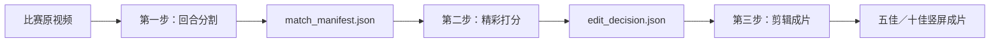

# 排球比赛五佳球／十佳球：项目目标与实施方案

更新日期：2026-09-09

## 1. 项目目标

建设一个本地视频分析和自动剪辑工具：用户给出一场排球比赛视频，可选指定球员号码，系统自动产出五佳球或十佳球的竖屏短视频合集。

项目只有三项主能力，按严格顺序交付：**回合分割 → 每回合精彩打分 → 剪辑成片**。比赛分析、球轨迹、号码识别、大模型和 FFmpeg 都是各步骤的实现细节，而不是并列的产品主线。

项目的策略是复用已有成熟模型和算法，不从零训练。`tools` 下的三个排球项目分别覆盖比赛理解、排球轨迹与竖屏构图、球衣号码定位；大模型 API 仅负责基于结构化候选回合进行语义排序、文案生成和剪辑编排。

首版交付结果是可复现的比赛包和成片，而不是完整的视频编辑器或自治代理平台。

## 2. 三步主流程

| 步骤 | 要解决的问题 | 主要结果 |
| --- | --- | --- |
| 1. 回合分割 | 从整场比赛中准确找出每一个回合及其起止时间 | `match_manifest.json` 中完整的回合清单和证据 |
| 2. 精彩打分 | 在已分割回合中选择最值得观看的五个或十个 | 带排名、原因和剪辑边界的 `edit_decision.json` |
| 3. 剪辑成片 | 把入选回合变为连贯的竖屏短视频 | 单回合片段及 `top5.mp4` 或 `top10.mp4` |

第一步是后两步的前提：未形成可靠回合清单时，不进入精彩排序或成片。第二步只比较回合，不让大模型直接扫描整场视频。第三步只执行已校验的剪辑决策。

## 3. 工具与实现细节

| 层 | 组件 | 用途 |
| --- | --- | --- |
| 比赛分析 | `tools/volleyball_analytics` | 输出比赛状态、动作、球场和排球检测结果，为回合边界及高光特征提供证据 |
| 球轨迹与短视频 | `tools/fast-volleyball-tracking-inference` | 输出 `ball.csv`、`track_*.json`，并用 `make_reels.py` 生成跟球竖屏视频 |
| 球员定位 | `tools/volleyball-highlights` | 通过 YOLO 与 OCR 识别球衣号码，输出指定球员出现片段 |
| 语义理解与编排 | 支持图像输入和结构化输出的大模型 API | 对预筛候选排序、说明入选原因、生成标题和剪辑单 |
| 编排与渲染 | 新建轻量 Python 项目 | 调用上游命令、统一结果、校验决策、调用 FFmpeg 合成成片 |

新项目建议建立在 `tools/volleyball-top-plays/`。保留上游项目完整、独立运行，不把模型代码复制进新项目。

GitHub 仓库只保存方案、许可证和新编排器源码；完整上游检出、模型权重、比赛素材及 `data` 均保留在本地，不纳入版本控制。部署时须先在本机准备三个上游项目及各自依赖环境，再运行编排器。

```text
tools/volleyball-top-plays/
├── run_match.py
├── agents/
│   ├── analytics.py
│   ├── rally.py
│   ├── player.py
│   ├── ranker.py
│   └── renderer.py
├── schemas.py
├── prompts/rank_top_plays.md
└── tests/
```

## 4. 系统架构



这是一套顺序、可恢复的工具工作流。所谓智能体只封装明确的输入、输出和失败处理：编排器不能让大模型任意执行命令，也不让各智能体自行改变流程。

## 5. 实施方案

### 阶段 1：做好回合分割

- 用同一段真实比赛视频跑通比赛分析和球追踪，确认可直接消费的输出和时间基准。
- 运行 `volleyball_analytics`，确认比赛状态、动作和检测结果可导出。
- 运行 `inference_onnx_seq_gray_v2.py` 和 `track_calculator.py`，确认获得 `ball.csv` 和 `track_*.json`。
- 建立“源视频秒数”为唯一主时间轴的适配器；多文件 DJI 素材拼接时记录每段偏移量。

完成条件：一场比赛得到完整候选回合清单，每个回合可追溯到原视频时间段、比赛状态和球轨迹证据。

### 阶段 2：做好每个回合的精彩打分

- 用连续 `PLAY` 区间和球轨迹的时间重叠形成候选回合。
- 为每回合补充动作集合、轨迹质量、持续时间、轨迹转折数和可选球员参与信息。
- 导出每个候选的开局、高潮、结尾关键帧。
- 对含清晰球衣号码的素材运行 `volleyball-highlights`，把指定球员参与度作为可选打分特征。
- 以规则过滤无有效轨迹、过短、重复或画面不完整的候选，保留约 20 至 30 个。
- 使用大模型对预筛候选进行语义排序、去重和文案生成。

完成条件：每次运行都能生成有效的五佳或十佳剪辑单；API 故障时仍有规则排序的可用结果。

### 阶段 3：剪辑成片

- 将剪辑单中的回合映射到 `track_*.json`，调用 `make_reels.py` 生成跟球 9:16 片段。
- 对轨迹缺失或构图失败的片段，以原视频居中裁剪作为降级路径。
- 用 FFmpeg 添加简单排名与标题文字，保持现场声音，按排名合并片段。
- 输出单个回合片段、最终 MP4、剪辑决策和渲染日志。

完成条件：生成时长合理、音画同步、片段数正确的 `top5.mp4` 或 `top10.mp4`。

## 6. 运行方式

```bash
python tools/volleyball-top-plays/run_match.py \
  --video /path/to/match.mp4 \
  --top-k 10 \
  --focus-player 12 \
  --format vertical
```

`--focus-player` 可省略。初版每次仅处理一场比赛，所有中间产物写入独立的 `runs/<match-id>/`，成功步骤可复用，失败步骤只重跑自身及后续步骤。

## 7. 关键约束与应对

| 约束 | 实施措施 |
| --- | --- |
| 上游 Python 依赖可能冲突 | 每个上游项目使用其现有虚拟环境；新编排器通过受控子进程调用命令行入口 |
| 三套结果的时间可能不一致 | 以原视频秒数为主时间轴，保存输入文件、帧率、拼接偏移和每个输出的时间转换记录 |
| 球衣号码在远景或遮挡时不可靠 | 将其作为排序特征而非强制条件；低置信度时输出通用十佳或标记不确定性 |
| 轨迹段不等于完整回合 | 同时使用比赛状态和轨迹时间重叠，并为渲染增加前后缓冲 |
| 大模型会误读画面或产生无效参数 | 只处理预筛候选；以 JSON Schema 与本地校验限制其输出；失败回退规则排序 |
| 模型无法适配特定机位 | 首版限定单机位、球场大致完整且球可见的素材；记录失败样本，不在首版训练新模型 |

## 8. 第一版范围与后续方向

首版聚焦单场比赛的五佳球／十佳球。它支持可选球员号码、竖屏跟球构图、标题和现场声，不承诺比分识别、完整技术统计、自动配乐、复杂转场、多机位融合、直播处理或全功能人工剪辑界面。

验证成片质量后，再考虑加入比分和解说信息、人工候选审核页、风格模板、跨场比赛球员集锦，以及针对失败机位的数据标注和微调。
